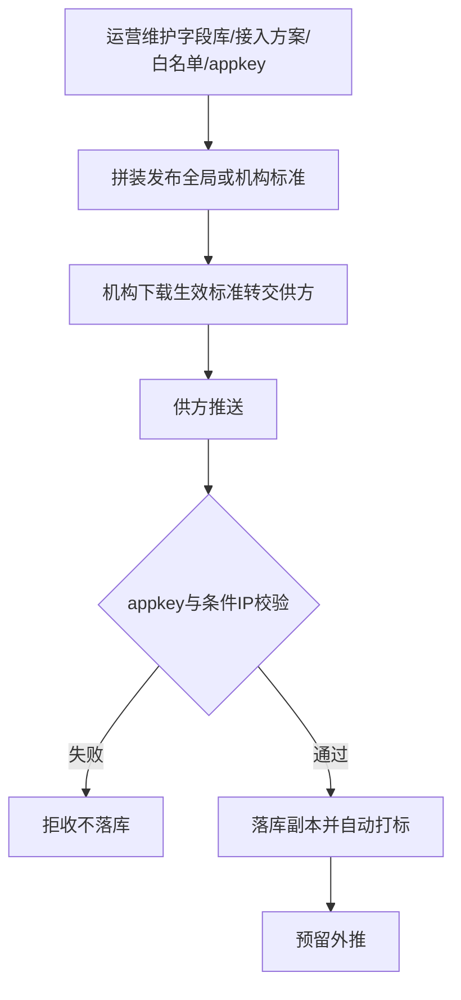

> **文档类型**：落地需求文档（PRD）  
> **交付模式**：快速（单文件；设计方案 v1.2 已确认）  
> **来源设计**：`docs/01-需求与规划/2026-09-08-云数中台-设计方案-v1.2.md`  
> **文档版本**：v1.2  
> **范围说明**：MVP 以汇聚落库与标准/安全为主；既有统计模块保持不变；外推与不区分机构供数预留  
> **最后更新**：2026-09-08（v1.2 历史稿；**现行真源见** `docs/2026-09-10-云数中台-PRD.md` v1.3）  
> **关系说明**：相对 `docs/2026-09-01-云数中台-PRD.md` 与设计 v1.1；2026-09-08 起曾以本文件为真源；**2026-09-10 起以 v1.3 PRD + SRS V1.3 为准**  

# 云数中台 · 产品需求文档（PRD）v1.2

## 第一部分 · 概念对齐

> 云数中台是给**平台运营**和**机构管理员**用的 **PC Web 多租户汇聚入口**：先把供数方按标准推来的数据**安全接入、单独落库并自动打标**；机构可下载生效接入标准转交供方。分析统计等**已有模块保持不变**，深化后置。  
> **形态**：PC Web（V8 机构端 + MT 运营端）+ 供方推送接入。  
> **不做（本期）**：数据外推实装；不区分机构的平台自有供数实装；改版既有统计看板。

---

## 第二部分 · 落地需求

## 1 产品概述

本期优先打通：字段库与接入方案库 → 拼装发布全局/机构标准 → 机构预览下载 → 供方凭 appkey（及条件 IP 白名单）推送 → 中台落副本并自动标注来源厂商、接收时间与归属机构。

## 2 目标用户与使用场景

| 角色 | 场景 |
|------|------|
| 平台运营 | 维护字段与接入方案，发布全局/机构标准；管理 appkey 与 IP 白名单 |
| 机构管理员 | 下载本机构生效标准并转交供方；继续使用既有概览/统计 |
| 供数方（系统） | 按生效标准推数，通过安全校验后入库 |

## 3 核心用户动线



## 4 功能清单

```
云数中台 MVP v1.2
├── 🔴 元数据字段库
├── 🔴 接入方案库（含是否白名单管控）
├── 🔴 接入标准拼装（全局 / 机构）
├── 🔴 IP 白名单管理
├── 🔴 供数方 appkey
├── 🔴 推送接收、落库副本、自动打标（区分机构）
├── 🔴 V8 生效标准预览/下载
├── 🔴 既有统计/供数配置等（保持不变）
├── ⚪ 不区分机构的自有供数
└── ⚪ 数据外推实装
```

## 5 功能详细描述

### 5.1 元数据字段库

维护可复用字段（字段名、业务含义、类型等）。启用后方可被标准勾选。

### 5.2 接入方案库

维护前置机、频次、增量/全量等；开关「是否需要 IP 白名单管控」。启用后方可被标准绑定。

### 5.3 接入标准拼装（全局 / 机构）

- 创建时勾选字段组成数据标准块，并绑定一个接入方案后发布。  
- **全局**：平台底稿，需有当前启用份。  
- **机构**：可覆盖；有启用中的机构标准则机构生效=机构标准，否则=全局。  
- 机构下载与供方推送校验均以**生效标准**为准。

### 5.4 IP 白名单与 appkey

- **appkey**：一供数方一凭证；无效或供方停用则拒收。  
- **IP 白名单**：仅当生效标准绑定的接入方案开启白名单管控时，来源 IP 必须已在白名单，否则拒收不落库。

### 5.5 推送落库与自动打标

校验通过后单独落一份副本；自动标注来源厂商、接收时间；本期必须能归属到机构。无法归属机构则拒收。预留域类型与外推字段。

### 5.6 既有模块

数据概览、供数统计、供数方查看、供数方管理、机构供数配置等：**保持当前已有内容与交互目标不变**。

## 6 非功能与验收

- 安全拒收不得写入落库副本。  
- 同生效标准下机构多次下载内容一致（对应该次发布版本）。  
- 验收：拼装发布、生效下载、appkey/白名单正反例、落库打标、既有模块未破坏性改版。  

## 7 本期不做

- 数据外推任务与配置界面  
- 不区分机构/不区分监测方案的推送通道实装  
- 改版既有分析统计模块  
