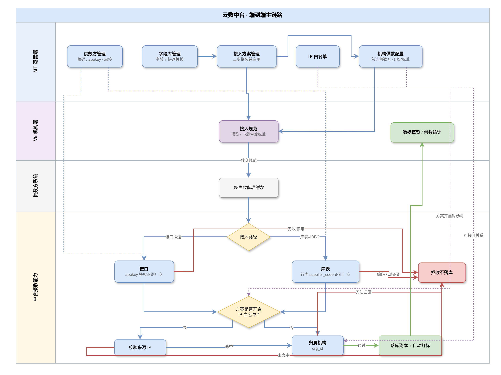
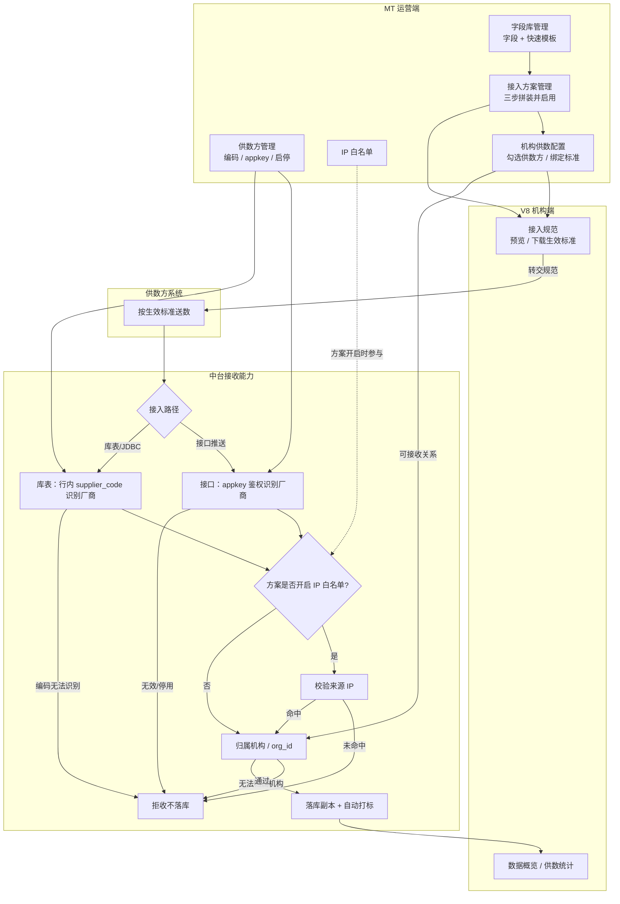
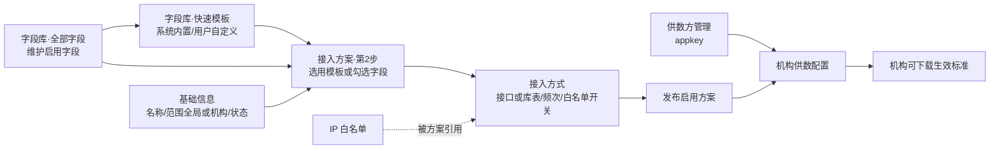
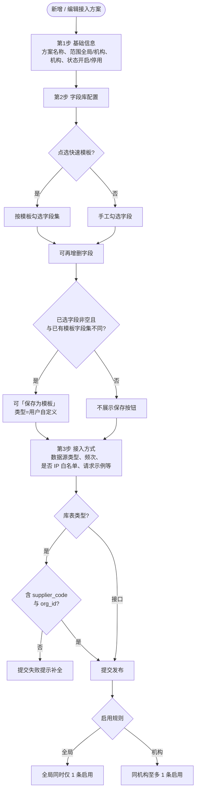
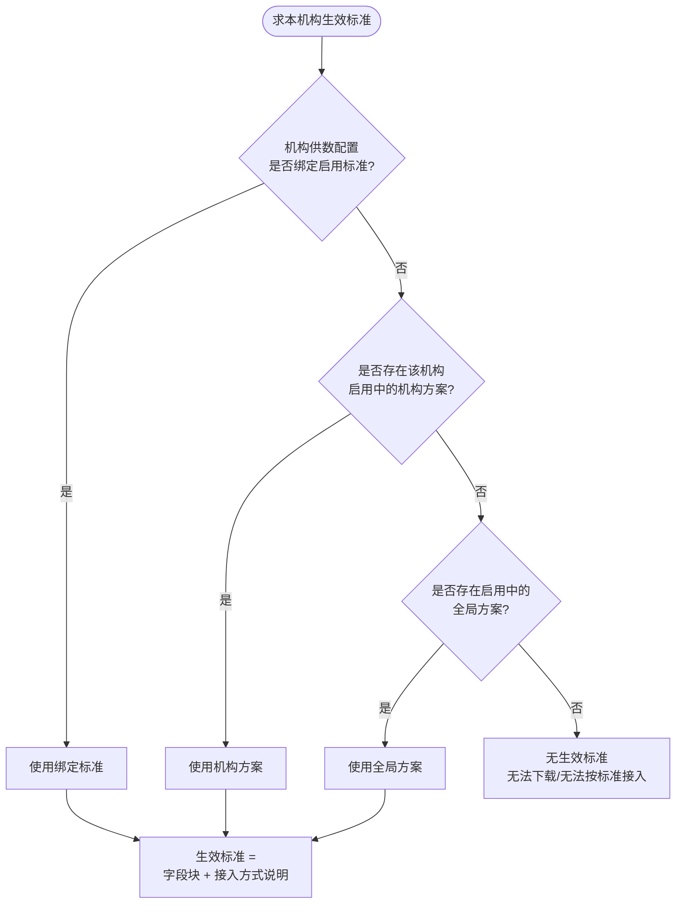
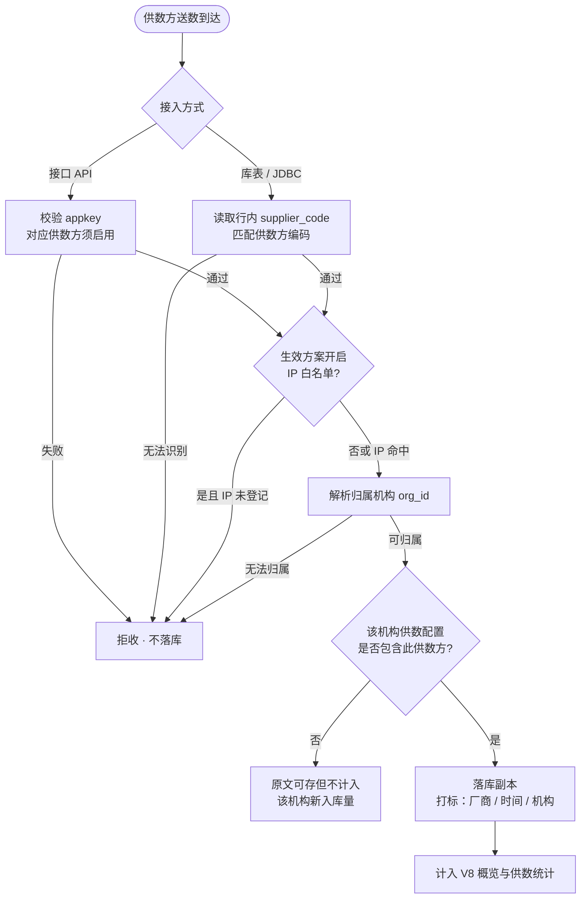
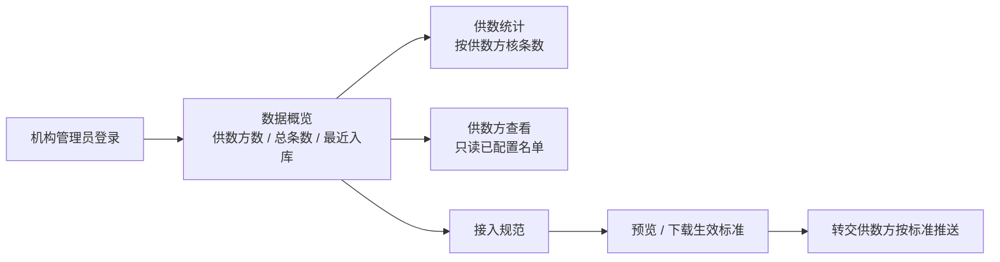
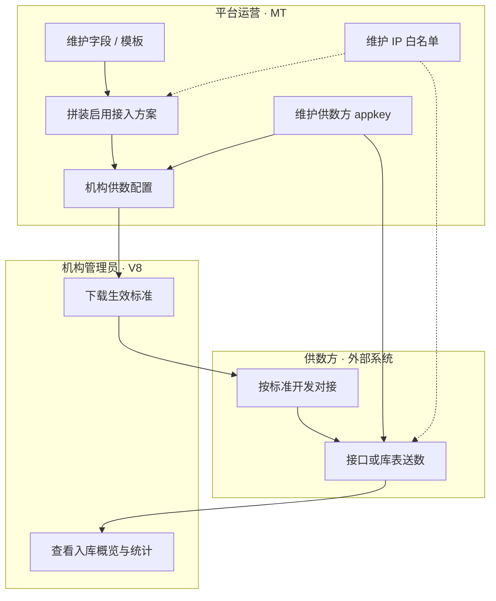
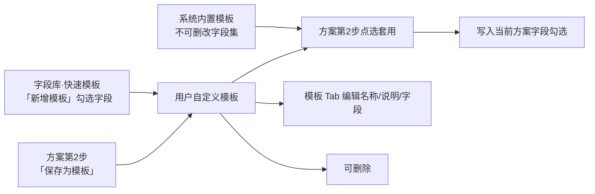

# 云数中台 · 核心业务流程（Mermaid）

> **依据**：SRS V1.2、落地 PRD v1.2、当前 `mt-web` / `v8-web` 功能模块  
> **日期**：2026-09-08  
> **说明**：以下为产品级业务流；推送接收为系统能力（无独立运营配置页，或挂在数据推送管理预留区）。

## 模块对照（当前实现）

| 端 | 模块 | 在主链路中的作用 |
| --- | --- | --- |
| MT | 供数方管理 | 主数据 + appkey，接口路径识别厂商 |
| MT | 机构供数配置 | 机构可接收供数方；可绑定生效标准 |
| MT | 字段库管理（全部字段 / 快速模板） | 标准字段素材；模板供方案第 2 步选用 |
| MT | 接入方案管理（三步：基础信息 → 字段库配置 → 接入方式） | 拼装「数据标准 + 接入策略」并发布 |
| MT | IP 白名单 | 方案开启白名单时强制校验来源 IP |
| MT | 数据推送管理 | 使用方 / 外推（本期预留深化） |
| V8 | 接入规范 | 预览/下载本机构生效标准 |
| V8 | 数据概览 / 供数统计 / 供数方查看 | 核验入库量与已配置关系（保持既有） |

---

## 1. 端到端主链路（总览）

运营定标准与关系 → 机构下载规范转交供方 → 供方按路径推数 → 中台校验落库打标 → 机构看量。

**draw.io 源文件**：[`docs/images/src/yunshu-e2e-main-flow.drawio`](./images/src/yunshu-e2e-main-flow.drawio)（推荐，可用 [diagrams.net](https://app.diagrams.net/) 或桌面版直接打开）  
同内容备份：[`yunshu-e2e-main-flow.xml`](./images/src/yunshu-e2e-main-flow.xml)  
**预览图**：





---

## 2. 运营配置准备流（模块串联）

先有字段与模板，再拼方案；供数方与白名单并行准备；最后给机构配关系。



---

## 3. 接入方案拼装（三步向导）

对应 MT「接入方案管理 → 新增/编辑」。



---

## 4. 生效标准判定（机构下载 / 推送校验共用）



---

## 5. 供数推送接收与落库（双路径）



---

## 6. 机构侧使用流（V8）



---

## 7. 角色 × 模块协作（泳道）



---

## 8. 快速模板生命周期



---

## 使用说明

- 在支持 Mermaid 的 Markdown 预览（GitHub、VS Code、部分 Wiki）中可直接渲染。  
- Google AI Studio / 其它工具可复制单个 ` ```mermaid ` 代码块使用。  
- 若需 draw.io PNG 版本，可再说明要导出的图号，走图表渲染流程。
