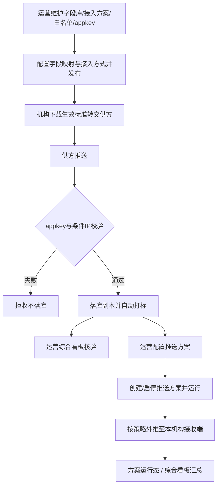

> **文档类型**：落地需求文档（PRD）  
> **交付模式**：标准 · 模式 C 增量融合  
> **来源设计**：`docs/01-需求与规划/2026-09-11-云数中台-综合看板-设计方案-v1.0.md`；并继承 v1.4 推送管理与 v1.3 运营配置口径  
> **文档版本**：v1.5  
> **范围说明**：在 v1.4 基础上，将 MT「供数统计 / 综合看板」升级为接入+推送双流总览（Tab：总览 / 接入 / 推送），汇报指标置顶、值班区靠下  
> **最后更新**：2026-09-11  
> **关系说明**：相对本文件 v1.4 增量融合；研发配套 SRS 以 `docs/01-需求与规划/20260911-云数中台-SRS需求规格说明书-V1.5.md` 为准  
> **后续版本**：推送方案即运行单元、列表/明细交互与推送类型口径等，以 **`docs/2026-09-13-云数中台-PRD.md`（v1.6）** 及配套 SRS V1.6 为准  

# 云数中台 · 产品需求文档（PRD）v1.5

## 【本次更新】变更摘要（2026-09-11 · v1.5）

本版相对 v1.4，按已确认《综合看板设计方案 v1.0》将 **MT 供数统计（综合看板）** 升为接入 + 推送双流分析；**保留** v1.4 推送管理与 v1.3 配置叙述。

| 模块 | 变更要点 |
|------|----------|
| 综合看板（原 MT 供数统计 / 规划「数据概览」） | Tab：总览 / 接入 / 推送；公共筛选时间+机构；汇报 KPI 置顶；值班区（失败/积压 Top、近24h失败趋势、零接入提示、链路对照） |
| 接入 Tab | 迁入并保留 v1.3 多维筛选与图表能力 |
| 推送 Tab | 新增推送成功/失败/成功率/积压分析与方案明细下钻 |
| 本期不做 | 取消「数据概览外推图表仅定边界」——本期实现总览级外推统计；环比同比、延迟 SLO、告警引擎仍不做 |

## 【历史】变更摘要（2026-09-10 · v1.4）

本版相对 v1.3，按已确认设计方案增量融合**数据推送管理**；**保留** v1.3 全部运营侧配置叙述，仅修订与外推冲突的「本期不做」及统计边界。

| 模块 | 变更要点 |
|------|----------|
| 数据推送管理 | 一级下两二级页：推送方案、机构推送任务；废弃独立「使用方」与 JDBC 源端外推模型 |
| 推送方案 | HTTP/MQ（文件禁用）；鉴权结构化；Cron/间隔 + 批量上限；增量/全量在方案内自选 |
| 机构推送任务 | 挂推送方案；数据=该机构全部已入库；同机构同通道类型唯一（启停均占坑）；运行态 + 简易 KPI |
| 供数统计 → 数据概览 | 后续更名；承接接入 + 外推整体统计；推送模块只做任务侧简易汇总 |
| 本期不做 | 外推整模块不做 → 改为文件通道实配、跨机构、真实调度等不做 |

## 【历史】变更摘要（2026-09-10 · v1.3）

| 模块 | 变更要点 |
|------|----------|
| 元数据字段库 | 独立「新增字段」页；表格批增；字段名判重；列表页去掉冗长页头说明 |
| 接入方案 | 三步创建/编辑；范围/状态/名称校验；字段映射；接入方式与文档预览/PDF；复制新增；同名校验 |
| 供数统计（MT） | 机构/方案/供数方多选筛选 + 时间跨度；空态「全部」；控件定宽定高；KPI 与趋势/分维图 |
| 机构供数配置 | 接入方案、供数方单选必填；备注 |
| IP 白名单 | 「新增」；字段序：IP → 供数方 → 备注 |
| 其它 | 文件传输类接入入口保留但禁用；去掉 SFTP 演示方案种子数据 |

---

## 第一部分 · 概念对齐

> 云数中台是给**平台运营**和**机构管理员**用的 **PC Web 多租户汇聚入口**：先把供数方按标准推来的数据**安全接入、单独落库并自动打标**；机构可下载生效接入标准转交供方；运营可将机构**已入库**数据按推送方案回推至本机构接收端。分析统计等模块在既有口径上保持可用，MT 侧**综合看板**在本期增强为接入+推送双流总览。  
> **形态**：PC Web（V8 机构端 + MT 运营端）+ 供方推送接入 + 中台外推配置。  
> **不做（本期）**：跨机构外推；文件传输类接入/外推通道正式开放（入口保留但禁用）；不区分机构的平台自有供数实装；真实调度引擎与对端生产联调（原型以 Mock 运行态验收）；看板环比同比、延迟分位 SLO、告警规则引擎。

---

## 第二部分 · 落地需求

## 1 产品概述

本期优先打通：字段库与接入方案（含字段映射与接入方式）→ 发布全局/机构方案 → 机构预览下载 → 供方凭 appkey（及条件 IP 白名单）推送 → 中台落副本并自动标注来源厂商、接收时间与归属机构 → **运营配置推送方案与机构推送任务，将本机构已入库数据外推至本机构接收端**。

**【本次更新】** 外推范围固定为该机构全部已入库数据；不按接入方案切分；无独立使用方主数据。

## 2 目标用户与使用场景

| 角色 | 场景 |
|------|------|
| 平台运营 | 维护字段与接入方案，发布全局/机构方案；管理 appkey 与 IP 白名单；配置推送方案并启停；查看**综合看板**（接入+推送） |
| 机构管理员 | 下载本机构生效标准并转交供方；继续使用既有概览/统计（外推配置不由机构自助） |
| 供数方（系统） | 按生效标准推数，通过安全校验后入库 |
| 机构接收端（系统） | 按推送方案约定的 HTTP/MQ 接收中台外推数据 |

## 3 核心用户动线



## 4 功能清单

```
云数中台 MVP v1.5
├── 🔴 元数据字段库（含批量新增页、字段名判重）
├── 🔴 接入方案管理（三步配置 / 复制新增 / 文档预览与 PDF）
├── 🔴 IP 白名单管理
├── 🔴 供数方 appkey / 方案级 AppKey+AppSecret（HTTP 鉴权）
├── 🔴 推送接收、落库副本、自动打标（区分机构）
├── 🔴 V8 生效标准预览/下载
├── 🔴 综合看板（总览/接入/推送双流；汇报置顶 + 值班区）【本次更新】
├── 🔴 机构供数配置（方案/供数方单选 + 备注）
├── 🔴 数据推送管理（推送方案等，见 v1.4）
├── ⚪ 看板环比同比 / 延迟 SLO / 告警引擎
├── ⚪ 文件传输类接入/外推通道正式开放
└── ⚪ 不区分机构的自有供数
```

## 5 功能详细描述

### 5.1 元数据字段库 【v1.3 保留】

维护可复用字段（字段名、描述、数据类型、长度、缺省值、业务分类、备注等）。启用后方可被接入方案勾选。

**列表**

- 支持按字段名/描述、业务分类、状态筛选。  
- 操作：详情、编辑（弹窗）、启用/停用、删除（有方案引用时不可删）。  
- **不**在页头展示冗长产品说明文案。

**新增（独立页面）**

- 入口：列表「新增字段」进入独立页（类似接入方案新增页形态）。  
- **表格批增**：一行一条字段；可「添加一行」一次提交 1～N 条。  
- 必填：字段名、描述、数据类型；长度/缺省值/业务分类/备注选填。  
- 字段名规则：英文字段标识（字母/数字/下划线，以字母或下划线开头）；创建后不可改。  
- **提交判重**：本批内字段名不得重复；不得与库中已有字段名重复。失败时明确提示冲突名并阻断。

**编辑**

- 仍使用弹窗编辑；字段名只读。

### 5.2 接入方案管理 【v1.3 保留】

运营以「接入方案」为配置单元：基础信息 + 字段库映射 + 接入方式；提交后生成接入文档，供预览/下载。

**列表**

- 展示方案名称、范围、机构、字段摘要、接入方式、白名单、状态、发布时间。  
- 操作：详情、预览文档、编辑、**复制新增**、开启/停用、删除。  
- **复制新增**：进入新增页并回填原方案全部可配置项；须修改方案名称后提交；**不允许同名方案**。

**创建 / 编辑（三步）**

1. **基础信息**  
   - 方案名称：必填；汉字/英文字母/数字/下划线；最长 100；提交时同名校验。  
   - 状态：开关（开启/停用）。  
   - 范围：全局 / 机构。提示文案：**「全局：所有机构都可选用本方案，机构：仅部分机构可选用本方案」**。选机构时必选机构。  
   - IP 白名单管控：开关；开启后推送须命中白名单。  
   - 备注：可选，文本框加高便于填写。  

2. **字段库配置**  
   - 从字段库勾选接入字段，并配置与供数方字段的映射。  
   - 提示：从字段库选择要接入的数据，并可配置映射；不满足需求时联系管理员扩充。  
   - 表格区域宽度与上方步骤条对齐。  

3. **接入方式**  
   - 可选：HTTP/HTTPS POST 推送、消息队列订阅；**文件传输类本期禁用**（不提供新配置）。  
   - HTTP：接口地址、协议、方法、鉴权（无鉴权 / AppKey+AppSecret）、请求头、QPS/重试/间隔/成功响应码、编码、字段校验等；关键字段下提供说明与格式占位（如「数字，如 3」）。  
   - 鉴权为 AppKey+AppSecret 时展示凭证（可手动改 / 自动生成）。  
   - 「生成示例」：须先校验基础信息必填；示例值按字段名/类型/业务含义自动填充贴近真实的样例。  
   - 「方案预览」与「下载 PDF」：内容与当前配置一致（概要、安全说明、接口/队列信息、字段表、请求示例、响应约定）；**不含**「来源识别说明」独立章节。  

**连通性测试**：按当前接入方式探测；失败仍允许保存（演示口径以提示为准）。

### 5.3 接入标准拼装（全局 / 机构） 【v1.3 保留】

> 产品叙述保留：生效标准 = 全局底稿或机构覆盖。  
> **实现口径**：MT「接入方案」已承载「勾选字段 + 绑定接入方式 + 范围」的拼装职责；V8 下载仍以机构生效方案/标准为准。不另拆平行「标准库」交互，避免双真源。

- **全局**：所有机构都可选用。  
- **机构**：仅部分（所选）机构可选用。  
- 机构下载与供方推送校验均以**生效配置**为准。

### 5.4 IP 白名单与 appkey 【v1.3 保留】

- **appkey**：一供数方一凭证；无效或供方停用则拒收。HTTP 方案还可配置方案级 AppKey+AppSecret。  
- **IP 白名单**：仅当方案开启白名单管控时强制校验。  
  - 列表「新增」；表单字段顺序：**IP 地址 → 供数方 → 备注**。  

### 5.5 推送落库与自动打标 【v1.3 保留】

校验通过后单独落一份副本；自动标注来源厂商、接收时间；本期必须能归属到机构。无法归属机构则拒收。预留域类型与外推字段。

### 5.6 综合看板（原 MT 供数统计 / 数据概览）【本次更新 · v1.5】

菜单名：**综合看板**（承接原「供数统计」能力，对应规划中的「数据概览」双流分析）。

**信息架构**：Tab「总览 | 接入 | 推送」。

**公共筛选**：时间跨度、机构（多选）；查询 / 重置 / 刷新。  
**按 Tab 扩展**：接入 Tab 增加接入方案、供数方；推送 Tab 增加推送方案。

#### 5.6.1 总览 Tab

**汇报 KPI（置顶）**：接入总量、推送成功量、推送成功率、接入方案数、推送方案数、待推积压。  
- 成功率 = 成功 / (成功+失败)；无流量显示「—」。  

**值班区（靠下，标准档）**：

1. 链路对照：同时间窗接入总量 vs 推送成功量（不强制因果）  
2. 推送失败 TopN、待推积压 TopN（按推送方案，可跳转详情）  
3. 近 24h 失败趋势（**固定近 24h**，不受汇报时间窗改写）  
4. 接入异常提示：启用中且近 1 日接入量为 0 的接入方案  

**下钻**：KPI / TopN / 提示行可跳转接入数据明细、推送数据明细或方案详情（带筛选参数）。

#### 5.6.2 接入 Tab

保持 v1.3 增强能力：接入总量 / 当前堆积 / 覆盖机构 / 供数方数；趋势；按机构/接入方案/供数方分维；组合明细表。堆积文案标明「待消费/待处理」。

#### 5.6.3 推送 Tab

推送成功量、失败量、成功率、积压、启用方案数；成功/失败趋势；按机构、按推送方案（可选通道类型）；方案明细表（含跳转详情/推送数据明细）。

#### 5.6.4 与推送模块边界

| 能力 | 归属 |
|------|------|
| 推送方案配置、启停、方案级运行统计 | 数据推送管理 |
| 接入+推送整体吞吐、成功率、积压与交叉对照 | **综合看板** |

设计真源：`docs/01-需求与规划/2026-09-11-云数中台-综合看板-设计方案-v1.0.md`。

### 5.6x 既有模块 · 机构配置 【v1.4 保留】

| 模块 | 本期要求 |
|------|----------|
| 数据概览 / V8 供数统计 / 供数方查看（机构端） | 保持 V1.0 目标，不破坏性改版；**不**替代 MT 综合看板 |
| 机构供数配置 | 保持 v1.3：接入方案、供数方单选必填；备注 |
| 供数方管理 | 保持可用 |

### 5.7 数据推送管理 【本次更新】

面向平台运营的外推配置与启停。一级菜单「数据推送管理」下两个二级页：**推送方案**、**机构推送任务**。废弃原「使用方」主数据及以 JDBC/源库为外推数据源的任务模型。

#### 5.7.1 推送方案

可复用模板：只定义**怎么推**（通道、鉴权、频次、批量、增量/全量），**不**绑定接入方案、**不**选择字段子集。

**列表**：方案名称、通道类型、推送模式、频次摘要、状态、更新时间；操作：详情、编辑、启停（可选复制新增）。

**表单**

1. **基础**：名称（全局唯一）、状态、备注。  
2. **通道**（对齐接入三种；语义为中台 → 机构）：  
   - HTTP、消息队列：**本期可用**；结构化鉴权/连接项（对齐接入侧字段语义，方向为外呼）。  
   - 文件传输类：**入口保留、禁用**，不可新建实配。  
3. **策略**：推送模式（增量 / 全量，用户自选）；频次（Cron **或** 固定间隔分钟）；批量条数上限；失败重试可与通道区合并展示。

**规则**

- 仅「启用」方案可被新任务选用。  
- 方案停用后，关联仍启用的任务须约束为不可保持启用（提示运维停用任务）。  
- 变更通道类型时，须校验是否导致机构侧「同通道类型」冲突。

#### 5.7.2 机构推送任务

将推送方案挂到机构并启停；**数据范围固定**：该机构全部已入库数据（只读说明，无接入方案选择器）。

**列表上方简易 KPI**：任务总数、启用中、近 24h 失败数（演示可用 Mock）。

**列表列**：机构、推送方案、通道类型、任务状态、最近运行状态、成功/失败次数、最近失败原因、更新时间；操作：编辑、启停。

**新建/编辑**：机构（必选）+ 推送方案（必选，展示通道类型）+ 任务状态。

**唯一性**：同一机构 + 同一通道类型（取自方案）仅一条任务；**启用与停用均占坑**。

**不做**：独立运行记录三级页；跨机构推送；任务级按接入方案/字段裁剪。

#### 5.7.3 与综合看板

| 能力 | 归属 |
|------|------|
| 方案配置、启停、方案级运行统计 | 数据推送管理 |
| 接入量 + 外推成功/失败/成功率/积压等整体趋势与交叉对照 | **综合看板**（v1.5 已纳入总览/推送 Tab） |

## 6 非功能与验收

- 安全拒收不得写入落库副本。  
- 同生效配置下机构多次下载内容一致（对应该次发布版本）。  
- **【v1.3 验收加项保留】**：字段批增同名拦截；方案复制新增同名拦截；生成示例缺必填拦截；预览/PDF 与表单字段一致；供数统计多选筛选结果与提示文案一致。  
- **【v1.4 · 外推验收保留】**：推送方案可配可存；相关唯一性与运行态按当时版本约定验收。  
- **【本次更新 · 综合看板验收】**：三 Tab 可切换；公共时间+机构筛选生效；总览 KPI 含接入与推送两侧；成功率无流量为「—」；值班区含失败/积压 Top、近24h 失败趋势、零接入提示与链路对照；可从 KPI/TopN 跳转明细或方案页。  

## 7 本期不做

- 跨机构订阅 / 向非本机构外推  
- 文件传输类接入与外推通道正式开放与生产联调  
- 真实调度引擎、对端真实联调（原型 Mock）  
- 推送任务按接入方案或字段子集裁剪  
- 看板环比 / 同比、延迟分位、SLO 与告警规则引擎  
- 不区分机构/不区分监测方案的自有供数实装  
- 改版 V8 侧分析统计深度看板  
