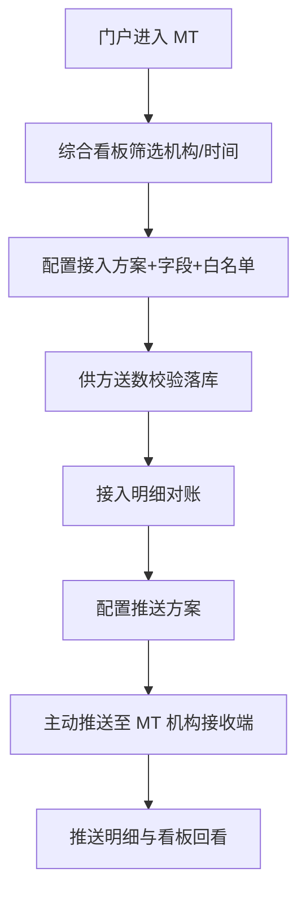

> **文档类型**：原型/站点功能盘点（PRD 前置真源）
> **输入源**：混合 — MT 管理端原型 `mt-web/` + 入口门户 `portal-web/` + 既有文档（功能确认单 / PRD v1.6 / SRS V1.6 / 设计方案）
> **结构参考**：`试用管理平台V1.0-产品PRD需求文档.docx`（用户上传）
> **盘点范围**：现行侧栏可达页面 + 系统接入/推送能力；共主路径约 13 页
> **盘点日期**：2026-09-14
> **关联 PRD**：`docs/2026-09-14-云数中台V1.0-产品PRD需求文档.md`

# 云数中台 · 原型盘点

## §1 输入与限制

- **真源优先级**：现行 `mt-web` / `portal-web` 可见交互 > 2026-09-14 功能确认单 > PRD/SRS V1.6 > 更早设计方案。
- **限制**：原型演示免登录；消息角标为 Mock；接入/推送执行链路以 Mock 验收，非生产联调。
- **未覆盖**：V8 机构端真实页面（本仓库仅为嵌入提示）；外网/专网 PC 端业务页（门户按钮未跳转）。

## §2 站点地图 / 页面清单

| 序号 | 页面名称 | 路径 | 模块 | 优先级建议 |
| --- | --- | --- | --- | --- |
| 0 | 产品入口门户 | portal-web `/` | 门户 | 🟡 |
| 1 | 综合看板 | `/stats` | 运营工作台 | 🔴 |
| 2 | 机构开通管理 | `/org/open` | 机构管理 | 🔴（V8 嵌入） |
| 3 | 机构用户管理 | `/org/users` | 机构管理 | 🔴（V8 嵌入） |
| 4 | 接入方案管理 | `/standard` | 数据接入 | 🔴 |
| 5 | 接入方案编辑 | `/standard/edit[/:id]` | 数据接入 | 🔴 |
| 6 | 接入方案详情 | `/standard/:id` | 数据接入 | 🔴 |
| 7 | 接入数据明细 | `/standard/access-data` | 数据接入 | 🔴 |
| 8 | 字段库管理 | `/metadata` | 数据接入 | 🔴 |
| 9 | 字段批量新增 | `/metadata/create` | 数据接入 | 🔴 |
| 10 | IP 白名单 | `/whitelist` | 数据接入 | 🔴 |
| 11 | 供数方管理 | `/suppliers` | 数据接入 | 🔴 |
| 12 | 推送方案管理 | `/push/schemes` | 数据推送 | 🔴 |
| 13 | 推送方案编辑 | `/push/schemes/edit[/:id]` | 数据推送 | 🔴 |
| 14 | 推送方案详情 | `/push/schemes/:id` | 数据推送 | 🔴 |
| 15 | 推送数据明细 | `/push/push-data` | 数据推送 | 🔴 |
| — | 接收方管理 | `/push/receivers` → schemes | 已隐藏 | ⚪ 本期不做独立菜单 |

```
云数中台
├── 🔴 综合看板
├── 🔴 机构管理（V8 标准页嵌入提示）
├── 🔴 数据接入管理
│   ├── 接入方案 / 明细 / 字段库 / 白名单 / 供数方
└── 🔴 数据推送管理
    ├── 推送方案 / 推送明细
    └── ⚪ 第三方接收方管理（原型已隐藏）
```

## §3 公共模块

### 3.1 全局导航 / 布局壳

- 顶栏：品牌「云数中台 · 运营管理系统」、消息角标、用户信息、退出。
- 侧栏：综合看板｜机构管理｜数据接入管理｜数据推送管理。
- 内容区：面包屑（综合看板自嵌面包屑）；机构副信息统一「统计单元·销售」。

## §4 分页面要点（摘要）

详见探索盘点；关键裁定见 §7。

## §5 主用户动线（草稿）



## §6 功能聚合表

| 功能模块 | 涉及页面 | 要点 | MVP |
| --- | --- | --- | --- |
| 综合看板 | `/stats` | 双流 KPI、趋势、分维、异常、下钻 | 🔴 |
| 机构管理 | `/org/*` | V8 嵌入提示 | 🔴 |
| 接入方案 | `/standard*` | 三步配置、启停、文档、明细 | 🔴 |
| 字段/白名单/供数方 | metadata/whitelist/suppliers | 主数据底座 | 🔴 |
| 推送方案 | `/push/schemes*` | 方案即运行单元、仅 MT 机构 | 🔴 |
| 推送明细 | `/push/push-data` | 结果筛选与追溯 | 🔴 |
| 第三方接收方 | Receivers（隐藏） | 不纳入本期菜单 | ⚪ |
| 门户三端入口 | portal-web | MT 可进；外网/专网占位 | 🟡 |

## §7 三视角缺口 / 已裁定（写 PRD 采用）

| 争议点 | 本期裁定（以现行原型为准） |
| --- | --- |
| 接收方管理 | **不做独立菜单**；推送目标仅支持 MT 机构 |
| 机构主数据 | **不在 MT 本地 CRUD**；开通/用户走 V8 嵌入 |
| 看板形态 | **单页总览**（无总览/接入/推送 Tab） |
| 推送频次 | **列表保留频次筛选与列**（以原型为准） |
| 文件通道 | **表单不开放**；历史 file 仅详情兼容 |
| 登录 | 原型演示免登录；正式交付需对接统一登录 `[待补充]` |

## §8 变更记录

| 日期 | 说明 |
| --- | --- |
| 2026-09-14 | 初稿：基于 mt-web/portal-web 与既有文档盘点 |
