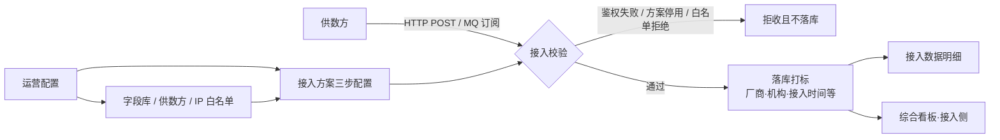
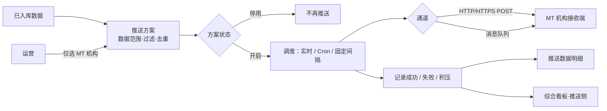
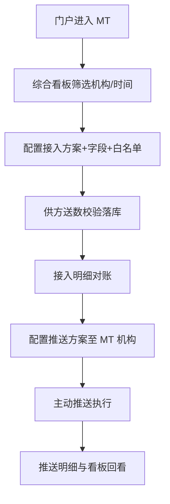

> **文档类型**：产品 PRD 需求文档
> **产品名称**：云数中台 V1.0
> **结构参考**：试用管理平台V1.0-产品PRD需求文档
> **原型盘点**：docs/2026-09-14-云数中台-原型盘点.md
> **文档版本**：V1.4
> **最后更新**：2026-09-18
> **交付模式**：快速（单文件详版；对齐正式汇报结构）

# 云数中台V1.0-产品PRD需求文档

---

## 1. 版本说明

| 项目 | 内容 |
|------|------|
| 产品名称 | 云数中台 · 运营管理系统（含入口门户） |
| 文档名称 | 云数中台V1.0-产品PRD需求文档 |
| 文档版本 | V1.4 |
| 编制日期 | 2026-09-14 |
| 最后更新 | 2026-09-18 |
| 编制单位 / 作者 | 产品四部 |
| 结构参考 | 试用管理平台V1.0-产品PRD需求文档（章节骨架对齐） |
| 内容真源优先级 | ① 现行原型（`mt-web` / `portal-web` + 原型盘点）② 功能确认单 V1.0 ③ PRD/SRS V1.7 及更早文档 |
| 适用范围 | MVP：产品入口门户、综合看板、机构管理（V8 嵌入）、数据接入管理、数据推送管理、接入/推送执行能力 |
| 配套文档 | `docs/2026-09-14-云数中台-原型盘点.md`；`docs/01-需求与规划/2026-09-14-云数中台-功能确认单-V1.0.md`；`docs/01-需求与规划/20260918-云数中台-SRS需求规格说明书-V1.8.md`（研发真源） |
| 文档状态 | 正式汇报详版（快速模式单文件）；V1.2 第 6 章去掉门户详述，功能详述统一为「功能点/操作/结果/异常描述」四列表；**V1.3 同步 2026-09-17/09-18 原型调整**（鉴权 Header、接口响应码、推送字段映射、明细与列表字段、看板口径、全局列表规范），变更以【V1.3 更新】标注；**V1.4 同步全局设计规范对齐**（顶栏/分页/列对齐/状态色/操作列等，按《康奈网络MT系统产品规范.docx》）**及接入方案详情页鉴权 Header 表格化**，变更以【V1.4 更新】标注 |

---

## 2. 本轮需求变更记录

| 序号 | 变更项 | 相对历史文档（PRD/SRS V1.6 等） | 本期裁定（以现行原型为准） | 影响模块 |
|------|--------|--------------------------------|------------------------------|----------|
| 1 | 推送目标 / 接收方 | V1.6 含独立「接收方管理」二级菜单，可维护第三方接收方 | **不做独立「接收方管理」菜单**；推送目标**仅支持 MT 机构**；`/push/receivers` 重定向至方案列表 | 推送方案、菜单 |
| 2 | 机构开通 / 用户 | 部分历史稿暗示 MT 本地机构 CRUD | **机构开通管理、机构用户管理 = V8 标准页嵌入提示**，非 MT 本地 CRUD | 机构管理 |
| 3 | 综合看板形态 | V1.5/V1.6 描述「总览 / 接入 / 推送」Tab | **单页总览**（仅 Overview 总览面板，无 Tab 切换） | 综合看板 |
| 4 | 推送方案列表·频次 | V1.6 写「无频次列、无最近推送列」 | **列表保留频次筛选与「频次」列**（点击可回填筛选）～V1.2 裁定；**V1.3 已再次变更：删除频次类型筛选与列，见序号 21** | 推送方案管理 |
| 5 | 文件通道 | 历史有文件类能力描述；V1.6 已收口表单不出文件 | **接入/推送表单与筛选均不开放文件通道**；历史 `file` 配置仅详情兼容展示 | 接入方案、推送方案 |
| 6 | 推送运行模型 | 早期「机构推送任务」独立页 | **方案即运行单元**：启停、调度、方案级成功/失败/积压均在推送方案 | 推送管理 |
| 7 | 详情页规范 | 部分旧稿有详情编辑与顶部 KPI | 详情**无「编辑」按钮、无顶部统计 KPI 卡**；编辑从列表进入 | 接入/推送详情 |
| 8 | 机构列展示 | 早期仅主名称 | 凡机构列：**主名称 + 副信息「所属统计单元·所属销售」** | 全局列表 |
| 9 | 明细默认时间 | 旧稿常默认近 N 天 | **时间默认空 = 历史全量**；看板等带参入口才预填 | 接入/推送明细 |
| 10 | 登录 | 原型演示免登录 | 正式交付需对接统一登录 **[待补充]** | 公共 |
| 11 | 功能详述粒度 / 界面原型 | V1.0 第 6 章以操作行为与线框为主；V1.1 曾用多表头字段表 | **功能详述统一为「功能点 / 操作 / 结果 / 异常描述」四列表**，结果列细化到字段与交互；**界面原型空置**，待原型截图/线框补充 | 全文第 6 章 |
| 12 | 第 6 章门户 / 编号顺延 | V1.1 含「6.1 产品入口门户」详述节 | **删除第 6 章门户整节**（3/4/5/8/9/10 章门户提及可保留）；原 6.2～6.12 顺延为 6.1～6.11；交叉引用同步（白名单=6.6，接入校验=6.10） | 第 6 章、引用 |
| 13【V1.3】 | 接入方式 · 接口地址 | 单输入框 + 请求协议（HTTPS/HTTP） | **网关（只读）+ 路由（可编辑）拆分**；路由自动生成（`/api/v1/push/`+8位随机）；完整地址**全局唯一**强校验（失焦即时 + 提交）；**删除「请求协议」**（协议由系统网关 HTTPS 前缀决定） | 接入方案 |
| 14【V1.3】 | 接入方式 · 鉴权方式 | none / appkey（含 AppKey+AppSecret、鉴权 Header 名、Content-Type） | 仅**无鉴权 / AppKey**；选 AppKey 展示**「鉴权 Header」列表字段**（启用/参数名/参数值/说明/删除，可添加行），默认第一行参数名 AppKey + 系统生成 32 位字母数字值，提示可手动修改；**删除 AppKey/AppSecret/Content-Type 独立字段** | 接入方案 |
| 15【V1.3】 | 接入方式 · 字段精简 | 含重试次数/重试间隔/成功响应码/数据编码/字段校验开关 | **删除上述低频字段**；保留最大 QPS 上限；**「接口响应码」改为固定默认示例表格**（200/400/401/403/500，行内编辑+删除，不可新增行）；「消息队列订阅」选项**禁用置灰** | 接入方案 |
| 16【V1.3】 | 接入方案列表 | 接入方式列；接入数据量单列（分时切换） | **删除「接入方式」列**；**接入数据量拆「累计/今日」两列**（各自下钻对应时间窗）；筛选仅 方案/机构/供数方/状态 | 接入方案 |
| 17【V1.3】 | 字段库配置入口 | Json 批量导入按钮（设计方案 v1.0） | **接入方案编辑步骤 2 与快速模板编辑页隐藏「Json批量导入」按钮**（组件能力保留，不暴露入口） | 接入方案、字段库 |
| 18【V1.3】 | 推送方式 · 鉴权与通道 | token 鉴权、Content-Type、QPS、成功响应码、频次类型、间隔、批量上限、数据配置模块 | **「消息队列推送」禁用置灰**（仅历史方案回显）；鉴权方式仅**无鉴权/AppKey** + 鉴权 Header 列表（同接入）；**删除请求协议/Content-Type/最大QPS上限/成功响应码/频次类型/间隔分钟/批量上限/数据配置**；保留重试次数与重试间隔；**选「全量」显示「选择时间段」** | 推送方案 |
| 19【V1.3】 | 推送数据配置 | 仅来源/过滤/去重；去重时间窗 1–8760 | 步骤 2 新增**「选择推送字段」映射区**（云数中台字段↔接收方字段，含「刷新」按钮，未选来源禁用；未选来源显示空态）；**「预览数据」移至该区下方**，展示映射后字段名及前 100 条；**时间窗上限 168h**（提示一周） | 推送方案 |
| 20【V1.3】 | 推送示例 | 「生成示例」按钮在标题行右侧 | 改为**「保存配置并生成示例」**，移至示例文本框上方独立行；点击先保存校验（缺失必填项提示）再生成 | 推送方案 |
| 21【V1.3】 | 推送方案列表 | 成功量/失败量单列 + 时间跨度下拉；推送方式/频次类型筛选与列 | **成功量/失败量拆「累计/今日」四列**（各自下钻）；**删除时间跨度下拉**；**删除「推送方式」「频次类型」筛选项与列** | 推送方案 |
| 22【V1.3】 | 明细页字段 | 含「平台」筛选与列 | 接入/推送明细**删除「平台」筛选与列**；**新增「内容标题」「URL 链接」文本筛选**（模糊匹配）；列表新增**「URL 链接」列**，点击新窗口打开 | 接入明细、推送明细 |
| 23【V1.3】 | 综合看板口径 | 异常区无分类提示；字段名「堆积/数量」；统计条数不定 | 异常区各 Tab **增加分类提示说明**（零接入=近3天无数据接入；高堆积=堆积量>100条；高失败率=近3天失败率>10%）；字段名统一**「堆积量」「失败率」**并按对应值降序（零接入按最近接入时间）；**维度统计默认 8 条**；接入/推送统计标题下增加口径说明文案；异常卡右上角统计数字统一样式 | 综合看板 |
| 24【V1.3】 | 全局列表规范 | 无统一约定 | 所有列表页**筛选项前加字段名标签**；**移除筛选结果数量条**（总数由分页 show-total 展示）；数据明细页保留筛选标签行 | 全局列表 |
| 25【V1.4】 | 全局设计规范 | 无统一设计基线 | 除机构管理与系统设置外全部模块按《康奈网络MT系统产品规范.docx》完成设计层对齐：顶栏（logo 点击回主页、右上角返回首页/消息/下载中心、点头像下拉退出登录并展示部门）、分页默认 100 条/页（10/50/100/200/500，翻页滚回表格顶部）、数字列居中、状态标签语义色（绿=成功/开启、红=失败、橙=警告、蓝=进行中、灰=停用）、可点击字段 hover 下划线+手型、截断列 Tooltip、单位入表头、操作列固定右侧且次要/危险操作收进「...」更多菜单、成功提示「对象+结果」。**仅设计规范层，功能与字段不变**（见 7.5） | 全局 |
| 26【V1.4】 | 接入方案详情页凭证 | 单独 AppKey 凭证卡（「自动生成」按钮） | 详情页凭证区改为**鉴权 Header 可编辑表格**（启用/参数名/参数值/说明/删除 + 添加行），支持行内增删改与启停，经「保存鉴权 Header」按钮独立保存；保存校验至少一行启用且参数名非空；首个启用且参数名为 AppKey 的行同步写入 appKey（兼容历史凭证逻辑） | 接入方案详情 |

---

## 3. 需求概述

### 3.1 需求背景

云数中台面向平台运营与机构侧数据汇聚场景：多家供数厂商按统一标准向中台送数，中台完成校验落库与打标后，再按机构维度将已入库数据**主动推送**回 MT 机构接收端（HTTP 或消息队列）。运营侧需要在同一套 PC Web 管理端完成：接入/推送配置、启停管控、明细对账、值班看板与主数据维护，避免配置散落、口径不一、问题难追溯。

本期交付以 **MT 管理端（`mt-web`）** 为核心，辅以 **产品入口门户（`portal-web`）** 作为三端入口聚合页；机构开通与用户管理复用 **V8 应用集成管理中心**标准页，不在中台重复建设。

### 3.2 业务现状与建设必要性

| 维度 | 现状痛点 | 建设必要性 |
|------|----------|------------|
| 接入配置 | 多供数方、多机构字段口径不一，缺少统一方案与字段库 | 以「接入方案」固化字段映射与通道，生成可下发文档 |
| 安全接入 | 来源 IP、鉴权缺少统一管控面 | 方案级白名单开关 + 平台级 IP 白名单，拒收不落库 |
| 推送外发 | 外发策略与结果散落，难按方案启停与统计 | 「推送方案即运行单元」，绑定 MT 机构与调度策略 |
| 运营值班 | 缺少双流（接入/推送）一屏总览与下钻 | 综合看板 + 明细带参跳转，支撑汇报与排障 |
| 机构主数据 | 机构开通/用户已在 V8 体系 | 中台侧嵌 V8，避免双维护 |

### 3.3 业务需求（条目化）

1. 提供产品入口门户，聚合 MT 管理端、外网 PC、专网/移动等入口（本期 MT 可进，外网/专网可占位）。
2. 提供综合看板：接入/推送概况 KPI、趋势对比、分维统计与异常区，支持机构多选与时间跨度筛选，并可下钻明细。
3. 机构开通管理、机构用户管理通过 V8 标准页嵌入提示对接，不在 MT 本地维护机构用户 CRUD。
4. 维护供数方、字段库（含快速模板）、IP 白名单等主数据，支撑接入配置与校验。
5. 配置接入方案（基础信息 / 字段库 / 接入方式三步），支持列表筛选、KPI、启停、复制、删除、文档预览与 PDF 下载、详情只读。
6. 按方案/机构/供数方/时间等查询接入数据明细，默认全量，支持带参预填与字段级筛选。
7. 配置推送方案（基础信息 / 推送数据 / 推送方式三步），目标仅 MT 机构；支持推送模式筛选、成功/失败量累计与今日下钻、启停、复制、删除、详情只读（【V1.3 更新】无频次筛选与列）。
8. 按方案/机构/推送结果/时间等查询推送数据明细，支持成功/失败筛选与下钻。
9. 系统侧按方案完成接入鉴权与白名单等校验，通过后落库打标；按推送方案调度主动推送并记录结果。
10. 列表机构列统一展示统计单元·销售副信息；原型期可免登录演示，正式环境对接统一登录 [待补充]。

### 3.4 业务目标

| 目标 | 说明 | 度量（示意） |
|------|------|--------------|
| 入出可控 | 接入拒收可解释；推送启停按方案生效 | 停用方案后新流量为 0；拒收不落库 |
| 配置可交付 | 接入文档可预览/下载给供数方 | 方案保存后可生成文档 |
| 运营可值班 | 一屏看双流 KPI/趋势/异常并可下钻 | 看板筛选后图表与列表联动 |
| 问题可追溯 | 接入/推送明细可按方案与结果查询 | 带参跳转筛选项正确回填 |
| 边界清晰 | 无第三方接收方菜单；无文件通道开放；机构非本地 CRUD | 菜单与表单验收清单通过 |

---

## 4. 功能概览与架构

### 4.1 系统流程图

#### 4.1.1 数据接入流

#### 4.1.2 数据推送流

#### 4.1.3 主用户动线（运营）

### 4.2 功能清单

| 序号 | 模块 | 子模块 | 功能 | 功能描述 | 版本号 | 优先级 | 备注 |
|------|------|--------|------|----------|--------|--------|------|
| 1 | 产品入口门户 | 门户首页 | 三端入口展示 | 展示云数中台品牌与 MT / 外网 PC / 专网·移动入口卡片 | V1.0 | P1 | portal-web `/` |
| 2 | 产品入口门户 | MT 入口 | 打开管理端 | 新窗口打开 MT 综合看板（可配 `VITE_MT_DASHBOARD_URL`） | V1.0 | P0 | 本期可验收 |
| 3 | 产品入口门户 | 外网/专网 | 入口占位 | 外网 PC、专网/移动按钮占位，业务页跳转 [待补充] | V1.0 | P2 | 本期不做联跳 |
| 4 | MT 公共 | 布局壳 | 顶栏与侧栏 | 品牌「云数中台 · 运营管理系统」；【V1.4 更新】logo 区域可点击回主页、右上角返回首页/消息（角标）/下载中心、点击头像下拉退出登录并展示部门；侧栏菜单分组 | V1.0 | P0 | 演示免登录 |
| 5 | MT 公共 | 机构展示 | 副信息规范 | 机构主名下展示「所属统计单元·所属销售」 | V1.0 | P1 | 全局列表 |
| 6 | 综合看板 | 全局筛选 | 机构多选 + 时间跨度 | 机构：全部/多选；时间：今日/近3天/近1周/近1月；刷新 | V1.0 | P0 | `/stats` |
| 7 | 综合看板 | 接入概况 | KPI | 接入数据总量、接入方案数、当前堆积量；元信息：机构/供数方/字段数 | V1.0 | P0 | 单页总览 |
| 8 | 综合看板 | 推送概况 | KPI | 推送成功总量、推送方案数、推送成功率；元信息：机构/积压/失败 | V1.0 | P0 | |
| 9 | 综合看板 | 趋势 | 接入 vs 推送 | 折线对比接入量与推送成功量 | V1.0 | P0 | |
| 10 | 综合看板 | 接入分维 | 柱图+列表 | 按机构/方案/供数方；点击下钻接入明细并带筛选 | V1.0 | P0 | |
| 11 | 综合看板 | 推送分维 | 柱图+列表 | 按机构/方案；失败/成功可带 `pushResult` | V1.0 | P0 | |
| 12 | 综合看板 | 异常区 | 接入/推送异常 | 零接入、高堆积；高失败率、高积压等 Tab 列表 | V1.0 | P0 | |
| 13 | 机构管理 | 机构开通 | V8 嵌入提示 | 展示调用 V8「指令流转中心」标准页参数，非本地 CRUD | V1.0 | P0 | `/org/open` |
| 14 | 机构管理 | 机构用户 | V8 嵌入提示 | 同上路由不同菜单标题 | V1.0 | P0 | `/org/users` |
| 15 | 接入方案 | 列表看板 | KPI + 筛选 + 表 | 方案总数（启用/停用可筛）、列表列含分时接入量等 | V1.0 | P0 | `/standard` |
| 16 | 接入方案 | 新增/编辑 | 三步向导 | 基础信息 → 字段库配置 → 接入方式（HTTP/MQ） | V1.0 | P0 | `/standard/edit[/:id]` |
| 17 | 接入方案 | 复制 | 复制创建 | `?copyFrom=` 回填，提示改名后提交 | V1.0 | P0 | |
| 18 | 接入方案 | 启停 | 列表开关 | 停用确认后拒收新数据；已接入不受影响 | V1.0 | P0 | |
| 19 | 接入方案 | 删除 | 仅停用可删 | 开启态按钮置灰；删除不可恢复 | V1.0 | P0 | |
| 20 | 接入方案 | 接入文档 | 预览/PDF | 列表「预览文档」；支持 PDF 下载 | V1.0 | P0 | |
| 21 | 接入方案 | 详情 | 只读 | 无编辑、无顶部 KPI；基础→字段→方式 | V1.0 | P1 | `/standard/:id` |
| 22 | 接入数据明细 | 查询 | 多维筛选 + 分页 | 方案/机构/供数方/内容标题/URL链接/接入时间/发布时间；默认全量（【V1.3 更新】无平台筛选） | V1.0 | P0 | `/standard/access-data` |
| 23 | 字段库 | 字段维护 | CRUD + 启停 | 新增/编辑/启停/删除；被引用不可删 | V1.0 | P0 | `/metadata` |
| 24 | 字段库 | 批量新增 | 批量页 | `/metadata/create` 批量录入 | V1.0 | P1 | |
| 25 | 字段库 | 快速模板 | 系统/自定义 | 模板列表、新增编辑、详情；系统模板不可删 | V1.0 | P1 | Tab「快速模板」 |
| 26 | 字段库 | 引用查看 | 引用方案抽屉 | 展示引用方案列表并可跳转 | V1.0 | P1 | |
| 27 | IP 白名单 | 维护 | 增删启停 | 按供数方批量录入 IP；开启态参与校验 | V1.0 | P0 | `/whitelist` |
| 28 | 供数方 | 主数据 | CRUD + 启停 | 名称、编码、状态；编码可复制；引用限制删除 | V1.0 | P0 | `/suppliers` |
| 29 | 推送方案 | 列表看板 | KPI + 筛选 + 表 | 含推送模式/成功失败量（累计+今日）；KPI 可筛状态（【V1.3 更新】无通道/频次列） | V1.0 | P0 | `/push/schemes` |
| 30 | 推送方案 | 新增/编辑 | 三步向导 | 基础（仅 MT 机构）→ 数据范围过滤去重 → 推送方式 | V1.0 | P0 | `/push/schemes/edit[/:id]` |
| 31 | 推送方案 | 复制 | 复制创建 | 若原方案为第三方目标，提示改选 MT 机构 | V1.0 | P0 | |
| 32 | 推送方案 | 启停/删除 | 列表管控 | 停用后不再推送；仅停用可删 | V1.0 | P0 | |
| 33 | 推送方案 | 成功/失败下钻 | 跳转明细 | 携带 `schemeId`/`schemeName`/`pushResult` | V1.0 | P0 | |
| 34 | 推送方案 | 详情 | 只读 | 无编辑、无顶部 KPI | V1.0 | P1 | `/push/schemes/:id` |
| 35 | 推送数据明细 | 查询 | 多维筛选 + 分页 | 含推送结果成功/失败；默认全量 | V1.0 | P0 | `/push/push-data` |
| 36 | 系统能力 | 接入校验 | 鉴权+白名单等 | 不通过拒收不落库 | V1.0 | P0 | 执行层 |
| 37 | 系统能力 | 落库打标 | 来源/机构/时间 | 支撑统计与追溯 | V1.0 | P0 | |
| 38 | 系统能力 | 主动推送 | 调度执行 | HTTP/MQ 推送并记成功失败积压 | V1.0 | P0 | Mock 可验收 |
| 39 | （不做） | 接收方管理 | 第三方档案 | 历史确认单曾列 P0；本期**无独立菜单** | — | — | 见变更记录 |
| 40 | （不做） | 文件通道 | 表单开放 | 表单/筛选不出现文件类；详情可兼容历史 | — | — | |

---

## 5. 用户角色与使用场景

### 5.1 用户角色表

| 角色 | 典型用户 | 主要职责 | 主要使用模块 | 权限说明 |
|------|----------|----------|--------------|----------|
| 平台运营（值班） | MT 运营人员 | 看双流 KPI、异常、下钻明细 | 综合看板、接入/推送明细 | 原型演示全量；正式 RBAC [待补充] |
| 平台配置员 | 数据接入/推送配置人员 | 配置方案、字段、白名单、供数方 | 数据接入管理、数据推送管理 | 同上 |
| 机构管理员 | 机构侧管理员（经 V8） | 机构开通与用户 | 机构管理（V8） | 能力在 V8，中台仅嵌入 |
| 供数方对接人 | 厂商实施（间接） | 按接入文档送数 | 不直接登录 MT（收文档） | 文档下发 |
| 产品/领导 | 汇报对象 | 门户入口与看板总览 | 门户、综合看板 | 只读倾向 |

### 5.2 使用场景

#### 场景一：值班早会看双流总览

1. 运营从门户进入 MT，默认落在 `/stats`。
2. 选择机构（可多选）与时间「今日」，点击刷新。
3. 查看接入概况与推送概况 KPI、趋势图。
4. 在异常区发现「高失败率」方案，点击下钻至推送明细（带方案 + `pushResult=fail`）。
5. 核对失败样本后，回到推送方案列表检查通道配置或临时停用。

#### 场景二：为新机构开通接入

1. 在供数方管理新增/确认供数方编码，复制给厂商。
2. 在字段库确认字段或套用快速模板；必要时批量新增。
3. 在 IP 白名单为该供数方录入来源 IP 并启用。
4. 新增接入方案：选机构与供数方、开启白名单管控、勾选字段、配置 HTTP 或 MQ。
5. 保存后预览/下载接入文档发给供数方；列表开启方案。
6. 供方送数后，在接入数据明细按方案与时间核对入库。

#### 场景三：配置回推至 MT 机构

1. 确认目标机构已在 V8 侧开通（机构管理菜单查看嵌入提示/正式环境进 V8）。
2. 新增推送方案：目标仅可选 MT 机构；选择接入方案或数据源作为范围；配置过滤与（可选）去重。
3. 第三步配置推送方式（HTTP/HTTPS POST；消息队列推送禁用）与鉴权（无鉴权/AppKey + 鉴权 Header）；全量模式选择时间段【V1.3 更新，不再配置频次与批量上限】。
4. 开启方案后，在推送方案列表观察成功/失败量；点击失败量进明细。
5. 看板推送概况同步反映成功率与积压。

#### 场景四：停用与清理无效方案

1. 列表将接入或推送方案开关切至停用，确认弹窗文案明确「已产生数据不受影响 / 不再推送」。
2. 停用后尝试删除，确认「删除后不可恢复」。
3. 开启态删除按钮置灰并 Tooltip「请先停用」。
4. 字段被方案引用时不可删除；供数方被引用时限制删除。

---

## 6. 功能设计

### 6.1 综合看板

#### 6.1.1 功能描述

综合看板为 MT 默认首页，**单页总览**（无「总览/接入/推送」一级 Tab）。顶部固定筛选：机构多选、时间跨度、刷新。主体为 Overview：接入概况 + 推送概况双栏 KPI、接入 vs 推送趋势、接入/推送分维统计（内嵌维度 Tab，**【V1.3 更新】默认展示 8 条，标题下含口径说明文案**）、接入/推送异常区（**【V1.3 更新】各 Tab 含分类提示说明与排序口径**）。支持点击图表/列表下钻至接入或推送明细并携带筛选参数。

#### 6.1.2 界面原型

（本期空置，待原型截图/线框补充）

#### 6.1.3 功能详述

| 功能点 | 操作 | 结果 | 异常描述 |
|--------|------|------|----------|
| 全局筛选 | 选择机构多选、切换时间跨度、点刷新 | 筛选区字段： ①机构：多选下拉可搜索可清空，未选展示「机构：全部」，默认空=全部机构 ②时间跨度：单选按钮组，今日=`today` / 近3天=`3d` / 近1周=`1w` / 近1月=`1m`，默认今日 ③刷新按钮（loading 防重复点击）。 切换后整页 KPI/趋势/分维/异常区按同一筛选重算。下钻明细 `range` 映射：今日→`today`、近3天→`d3`、近1周→`w1`、近1月→`m1`（不得原样传 `3d`/`1w`/`1m`）。 | 加载失败 Toast「看板数据加载失败」；机构搜索无匹配展示「无匹配机构」 |
| 接入概况 KPI | 查看或点击可下钻指标 | KPI： ①接入数据总量（主，可下钻 `/standard/access-data`，带 `range`；已选机构时带首个 `orgId`） ②接入方案数（可下钻 `/standard`） ③当前堆积量（只读） 副信息：机构（有接入数据机构去重）、供数方（去重）、字段（开启方案勾选字段去重总数）。 | 无数据时 KPI 展示 0 或空态占位；下钻失败停留看板并 Toast |
| 推送概况 KPI | 查看或点击可下钻指标 | KPI： ①推送成功总量（可下钻推送明细，带 `range`/机构等） ②推送方案数（可进推送方案列表） ③推送成功率=成功/(成功+失败) 副信息：机构（推送覆盖机构数）、积压（各方案 backlog 合计）、失败（失败条数合计）。 | 无推送流量时成功率显示「—」 |
| 趋势图 | 只读查看 | 折线对比系列：数据接入、推送成功；随全局筛选联动。 | 系列无点时空图；加载失败同全局 Toast |
| 接入分维统计【V1.3 更新】 | 切换维度 Tab；点击柱/行下钻 | Tab：按机构 / 按方案 / 按供数方；标题下说明文案「按机构/方案/供数方维度查看历史全量数据接入情况」。柱图与列表**默认各展示 8 条**；机构/供数方维度行含「方案数」列（按该范围内实际产生接入量的方案去重统计，有接入量必 ≥ 1）。下钻 `/standard/access-data`，可带 `orgId`/`orgName` 或 `schemeId`/`schemeName` 或 `supplierId`/`supplierName` + `range`。 | 无分维数据空列表；下钻参数缺失时明细按全量/默认筛 |
| 推送分维统计【V1.3 更新】 | 切换维度 Tab；点击成功/失败系列或列 | Tab：按机构 / 按方案；标题下说明文案「按机构/方案维度查看历史全量数据推送情况」。柱图与列表**默认各展示 8 条**。下钻 `/push/push-data`，可带 `pushResult=success\|fail` 及方案/机构 + `range`。 | 同接入分维空态；失败下钻须正确带 `pushResult=fail` |
| 异常区【V1.3 更新】 | 切换接入/推送异常 Tab；点击行下钻 | 接入异常 Tab（Tab 名下展示提示说明）： ①**零接入**（近 3 天无数据接入的方案），按最近「接入时间」排序 ②**高堆积**（当前接入堆积数据量超过 100 条的方案），「堆积量」字段按从大到小排序。 推送异常 Tab（Tab 名下展示提示说明）： ①**高失败率**（近 3 天推送总失败率超过 10% 的方案），「失败率」字段按从大到小排序 ②**高堆积**（当前推送堆积数据量超过 100 条的方案），「堆积量」字段按从大到小排序。 两组异常卡右上角统计数字为红色文字胶囊「N 项」，样式统一。出向 query 参数：`range`、`orgId`/`orgName`、`schemeId`/`schemeName`、`supplierId`/`supplierName`（接入）、`pushResult`（推送）。 | 无异常项空列表；下钻失败 Toast |

#### 6.1.4 业务规则

1. **形态裁定**：仅单页总览，不提供总览/接入/推送一级 Tab。
2. 筛选变更后看板内所有区块联动同一筛选条件。
3. 默认时间跨度为「今日」（`today`）。
4. 下钻 `range` 必须按映射表转换（`3d→d3`、`1w→w1`、`1m→m1`），不得原样传 `3d`/`1w`/`1m`。
5. 环比同比、延迟 SLO、告警规则引擎本期不做。
6. InboundPanel / OutboundPanel 组件可保留于工程，但**不作为本期看板主交互入口**。
7.【V1.3 更新】维度统计柱状图与列表固定展示前 8 条；异常区字段名统一为「堆积量」「失败率」，排序按对应值降序、零接入按最近接入时间。
8.【V1.3 更新】机构/供数方维度的「方案数」：有接入量则必 ≥ 1（按实际产生接入量的方案去重统计）。

---

### 6.2 机构管理（V8 嵌入提示：开通/用户）

#### 6.2.1 功能描述

侧栏「机构管理」下二级菜单：**机构开通管理**（`/org/open`）、**机构用户管理**（`/org/users`）。两页共用 `V8EmbedHint`：展示「调用 V8 应用集成管理中心标准页面」说明与调用参数，**不提供 MT 本地机构/用户 CRUD**。正式环境由宿主集成真实 V8 页面；原型以提示页验收嵌入约定。

#### 6.2.2 界面原型

（本期空置，待原型截图/线框补充）

#### 6.2.3 功能详述

| 功能点 | 操作 | 结果 | 异常描述 |
|--------|------|------|----------|
| 进入机构开通管理 | 侧栏进入 `/org/open` | 展示不可关闭的 V8 嵌入提示层；菜单标题「机构开通管理」。只读参数： ①应用名称=指令流转中心 ②应用唯一ID=`V8-P-17`（等宽） ③调用页面=`/MT-AIM-API/开通用户列表`（等宽） ④应用调用密钥=`V8-P-17-WUE7R7R8T0`（等宽） ⑤说明=无需二次开发。 提示「页面不可关闭」，须经侧栏离开。本页无筛选、无列表 CRUD。 | 密钥/应用 ID 错误导致正式调起失败时的运维流程 **[待补充]** |
| 进入机构用户管理 | 侧栏进入 `/org/users` | 页面形态与开通页相同（不可关闭提示层）；菜单标题「机构用户管理」；参数表与开通页一致。 | 同开通页 |
| 正式嵌 V8 | 宿主按参数调起 V8 标准页 | 正式环境由宿主集成真实 V8 页面；原型以提示页验收嵌入约定。 | 调起失败运维流程 **[待补充]** |

#### 6.2.4 业务规则

1. **本期裁定**：机构主数据不在 MT 本地 CRUD。
2. 提示页不可关闭；用户须通过左侧导航离开。
3. 原型参数为对接约定示例，生产密钥管理遵循安全规范 **[待补充]**。
4. 列表其它模块所选「机构」来自平台机构主数据/Mock，与 V8 正式同步方式 **[待补充]**。

---

### 6.3 接入方案管理（列表 / 编辑三步 / 详情）

#### 6.3.1 功能描述

接入方案是供数接入的配置与运行单元：绑定机构、供数方、字段映射与接入方式（**仅 HTTP/HTTPS POST；消息队列订阅选项禁用置灰【V1.3 更新】**），支持启停与文档输出。列表提供 KPI、筛选、点击回填、累计/今日接入量下钻明细等；编辑为三步向导；详情只读（无编辑按钮）。

#### 6.3.2 界面原型

（本期空置，待原型截图/线框补充）

#### 6.3.3 功能详述

| 功能点 | 操作 | 结果 | 异常描述 |
|--------|------|------|----------|
| 列表 KPI | 查看；点击方案总数/开启/停用 chip | KPI： ①方案总数（点击清空状态筛并刷新；副展示「开启」「停用」chip 可点筛） ②机构数量（已配置接入方案的机构数，Tooltip 同义，不可下钻） ③供数方数量 ④活跃方案*（近 1 周累计接入量>10,000 条或至少 5 天有数据，Tooltip 口径） ⑤活跃机构* ⑥活跃供数方*。 | 加载失败 Toast；无方案时总数为 0 |
| 列表筛选【V1.3 更新】 | 选择/输入筛选项并查询 | 筛选字段（筛选项前含字段名标签）： ①方案：模糊建议选择（可关键字/选中 ID），可「全部方案」，默认空 ②机构：模糊建议，「全部机构」 ③供数方：模糊建议，「全部供数方」 ④状态：`enabled` 开启 / `disabled` 停用。**无「接入方式」筛选项**。列表列可点击回填对应筛选项。 | 无匹配空列表；关键字无建议展示空建议 |
| 列表展示与下钻【V1.3 更新】 | 点击列值下钻 | 列表列：方案 ID（点击复制，Toast「已复制方案 ID」）；方案名称（回填方案筛）；机构（主名+副信息「所属统计单元·所属销售」，可回填）；供数方；**接入数据量（累计/条）/ 接入数据量（今日/条）两列**（【V1.4 更新】单位入表头、数字居中；累计点击下钻接入明细带全量时间窗，今日带 `today`）；最近接入；状态 Switch；更新时间；操作（【V1.4 更新】详情/预览文档/编辑 +「...」更多菜单：复制/删除；操作列固定最右）。**无「接入方式」列**。 | 开启态删除禁用，Tooltip「请先停用」 |
| 列表启停 | 切换状态 Switch；确认停用 | 停用确认标题「停用方案」，内容：确定停用「{name}」？停用后按此方案接入的数据，云数中台将拒绝接收，已接入数据不受影响。【V1.4 更新】开启成功 Toast「开启成功「{name}」」、停用成功 Toast「已停用「{name}」」（对象+结果）。 | 确认取消无变更；启停失败 Toast |
| 列表删除 | 停用态点删除并确认 | 确认标题「删除接入方案」，内容：确定删除「{名称}」？删除后不可恢复，请谨慎操作！；开启态不可删。 | 开启态按钮置灰；删除失败 Toast |
| 列表复制 | 点复制 | 进入 `/standard/edit?copyFrom=`；提示「已回填原方案配置，请修改方案名称后提交」。 | copyFrom 无效时按新建空表 |
| 预览文档 / PDF | 点预览文档或下载 PDF | 可预览接入文档；PDF 下载 Toast「已开始下载 PDF」。 | Toast「PDF 下载失败」 |
| Step1 基础信息 | 填写并点下一步 | 字段： ①方案名称（必填，≤100，汉字/字母/数字/英文连字符"-"，全局唯一，占位「如：陕西省网信办-清博接入方案」） ②状态 Switch（enabled/disabled，默认开启） ③选择机构（必填，可搜索下拉，方案与机构**一对一**） ④选择供数方（必填，一对一） ⑤IP 白名单管控 Switch（默认关；开启后须维护白名单，非名单 IP 拒收，与平台 IP 白名单联动，见 6.6 / 6.10） ⑥备注（≤200）。 校验通过进入 Step2。 | 名称为空「请填写方案名称」；超长/非法字符提示「仅支持汉字、英文字母、数字、英文连字符"-"」；重名相应提示；未选机构/供数方不可进入下一步 |
| Step2 字段库配置【V1.3 更新】 | 勾选字段/套用模板并下一步 | 字段： ①字段勾选 FieldPicker（字段库启用字段，至少勾选 1 个，可选用快速模板填充） ②供数方字段名称（按行输入，默认同平台字段名） ③供数方字段类型（按行，默认同平台字段类型）。**「Json批量导入」按钮隐藏**（不在本页入口暴露）。 校验通过进入 Step3。 | 未勾选任何字段不可进入下一步/保存 |
| Step3 接入方式·HTTP【V1.3 更新】 | 选择 HTTP 并配置；可生成示例/连通测试；保存 | 接入方式下拉：`http_post` HTTP/HTTPS POST 推送 / `mq` 消息队列订阅（**`mq` 选项禁用置灰**）。HTTP 字段： ①接口地址=**网关（只读）+ 路由（可编辑）**：网关为系统配置 `https://ingress.yunshu.example.com`；路由为空时自动生成 `/api/v1/push/` + 8 位随机字母数字；格式以 `/` 开头仅允许字母/数字/`-`/`_`/`/`；完整地址**全局唯一**——路由失焦即时校验、提交强校验，重复报错「接口地址已存在，请修改路由部分」；字段下方常驻唯一性提示 ②请求方法固定 POST ③鉴权方式：仅「无鉴权」/「AppKey」 ④**鉴权 Header**（仅选 AppKey 时展示）：列表字段=启用复选框/参数名/参数值/说明/删除，底部「添加鉴权 Header」按钮；默认第一行参数名 `AppKey`+系统生成 32 位字母数字值，提示「AppKey系统默认生成32位字母数字组合，可手动修改」 ⑤最大 QPS 上限 1–10000 ⑥**接口响应码**：固定默认示例表格（200 成功 / 400 请求参数错误 / 401 鉴权失败 / 403 禁止访问 / 500 服务端错误），列=响应码/说明/操作，行内可编辑、可删除，**不可新增行**。 可「生成示例」「连通性测试」；测试未成功仍可保存。保存成功 Toast「已保存并生成接口文档」。 | 必填缺失不可保存；路由格式/唯一性校验提示；数值超范围提示；连通测试失败可提示但仍可保存 |
| Step3 接入方式·MQ（历史） | 选择 MQ 并配置；保存 | MQ 字段： ①消息队列种类 Kafka/BMQ/RocketMQ（默认 kafka；RocketMQ 时地址标签为 NameServer） ②接入地址集群/NameServer（多地址逗号分隔，必填） ③Topic 名称（必填） ④消费组名称（必填） ⑤鉴权 none/sasl/ssl（默认 none；sasl 显用户名密码；ssl 显证书路径） ⑥起始消费位点 latest（默认）/earliest ⑦消费并发数 1–64（默认 4） ⑧单次拉取最大条数 1–10000（默认 100） ⑨消息重试次数 0–20（默认 3） ⑩死信开关（默认开） ⑪数据格式 JSON ⑫开启字段校验（默认关） ⑬去重主键 ⑭堆积告警阈值（默认 10000） ⑮失败告警阈值（默认 3） ⑯成功响应码（默认 OK） ⑰SASL 机制 PLAIN/SCRAM（sasl 时） ⑱Offset 自动提交（Kafka 默认开） ⑲自动提交间隔 ms（默认 5000） ⑳消息 Tag 过滤（RocketMQ 建议填） ㉑消费模式 clustering（默认）/broadcasting ㉒单消息消费超时 ms（默认 15000）。 保存 Toast 同 HTTP。 | 必填缺失不可保存；种类切换未填地址/Topic/消费组提示 |
| 详情只读【V1.3 更新】 | 进入 `/standard/:id` 查看 | 只读：方案 ID/状态/方案名称；机构（含副信息）/供数方；IP 白名单管控是/否；最近接入/创建时间/更新时间/备注；字段库区、接入方式区按 HTTP/MQ（及历史 file 兼容）只读展示，**字段与编辑页对齐**（网关+路由、鉴权 Header、接口响应码表格）。【V1.4 更新】**例外：鉴权方式为 AppKey 时，鉴权 Header 为可编辑表格**（启用/参数名/参数值/说明/删除 + 「添加鉴权 Header」；行内增删改与启停；「保存鉴权 Header」独立保存，保存校验至少一行启用且参数名非空），为页面唯一可编辑区，替代原单独 AppKey 凭证卡。**无「编辑」按钮、无顶部 KPI**。操作记录列：操作类型（新建/修改/开启/停用 Tag）、操作内容、操作人、操作时间。 | 方案不存在空态/返回列表 |

#### 6.3.4 业务规则

1. 停用后按该方案的新接入请求拒收；已入库数据保留（确认文案见上）。
2. 仅停用态可删除；删除不可恢复。
3. 至少勾选一个字段方可进入后续步骤/保存。
4. 开启白名单管控时，接入校验使用启用态 IP（见 6.6 / 6.10）。
5. 详情不提供编辑入口与顶部统计卡。
6. 文件通道不在表单开放；详情若遇历史 `file` 可只读兼容展示。
7. 隐藏路由 `/scheme*` 不作为本期菜单入口。
8. 方案名称全局唯一；字符规则为汉字、英文字母、数字、英文连字符"-"（【V1.4 更新】修正历史「下划线」表述，与现行原型及 SRS 3.5.7 一致）。
9.【V1.3 更新】接口地址全局唯一：路由失焦即时校验 + 提交强校验，编辑时排除自身；协议由系统网关 HTTPS 前缀决定，表单不提供「请求协议」选择。
10.【V1.4 更新】AppKey 鉴权凭证：统一由「鉴权 Header」列表承载（编辑页与详情页一致，无单独 AppKey 输入字段与「自动生成」按钮）；默认第一行参数名 AppKey + 32 位系统生成值（可手动修改，最长 32 位）；详情页鉴权 Header 表格可编辑并经「保存鉴权 Header」独立保存，首个启用且参数名为 AppKey 的行同步写入 `appKey` 兼容历史凭证逻辑。
11.【V1.3 更新】接口响应码为固定默认示例表格，不支持新增行，仅行内编辑与删除。

---

### 6.4 接入数据明细

#### 6.4.1 功能描述

按接入方案、机构、供数方、内容标题、URL 链接、接入时间、发布时间等查询已接入明细；支持动态业务字段列、字段级模糊筛选、分页与记录详情抽屉。时间筛选**默认空=历史全量**；从看板等入口带参时预填。**【V1.3 更新】无「平台」筛选项与列。**

#### 6.4.2 界面原型

（本期空置，待原型截图/线框补充）

#### 6.4.3 功能详述

| 功能点 | 操作 | 结果 | 异常描述 |
|--------|------|------|----------|
| 明细筛选与查询【V1.3 更新】 | 选择筛选项、点查询/重置；路由带参自动回填 | 筛选字段（筛选项前含字段名标签；筛选标签行保留）： ①接入方案（模糊建议，支持 schemeId/名称） ②机构（模糊建议） ③供数方 ④**内容标题**（文本输入，对 `news_title` 模糊匹配） ⑤**URL 链接**（文本输入，对 `news_url` 模糊匹配） ⑥接入时间日期时间范围（默认**空=全量**，对应 `dateFrom`/`dateTo`，可带 `range`） ⑦发布时间范围（`publishFrom`/`publishTo`）。**无「平台」筛选项**。 支持 query：`schemeId`/`schemeName`、`orgId`/`orgName`、`supplierId`/`supplierName`、`range`（total/today/d3/w1/m1）、接入/发布时间起止。无时间条件按全量窗口（`range=total`）。 | 查询失败 Toast；无结果空列表；带参回填失败时筛选项保持默认全量 |
| 列展示与回填【V1.3 更新】 | 点击方案/机构/供数方列回填；分页 | 列表列：方案名称（副显方案 ID，可回填）；机构（主名+副信息，可回填）；供数方；接入时间；内容标题（字段 `news_title`，副显 `news_uuid`，点击行开抽屉）；**URL 链接**（字段 `news_url`，超链接点击**新窗口打开**，无值显示「—」）；发布时间 `news_posttime`；作者昵称 `media_name`。**无「平台」列**。支持字段级模糊筛选与分页。 | 仅展示已成功落库数据；拒收不在本列表（拒收日志 **[待补充]**） |
| 记录详情抽屉 | 点击行打开抽屉 | 只读：方案名称/方案 ID；机构/机构补充（主名+统计单元·销售）；供数方；接入时间；供数方编码 `supplier_code`；机构编码 `org_id`；平台类型/平台名称；内容唯一ID `news_uuid`；内容标题 `news_title`；发布时间 `news_posttime`；作者昵称 `media_name`；以及发布者ID/信息链接/摘要/正文/作者/阅读数/点赞数等（按字段库动态）。 | 抽屉加载失败提示；关闭后回到列表 |

#### 6.4.4 业务规则

1. 无时间条件时按全量窗口查询（`range=total` 口径）。
2. 机构列展示副信息规范。
3. 仅展示已成功落库数据；拒收记录不在本列表（拒收日志 **[待补充]**）。
4. 看板下钻带入的 `range`/`orgId` 等须正确回填筛选项并自动查询。
5.【V1.3 更新】内容标题 / URL 链接筛选为文本模糊匹配；URL 链接列点击新窗口打开（`target="_blank"`），无值显示「—」。

---

### 6.5 字段库管理（字段 + 模板）

#### 6.5.1 功能描述

维护平台标准字段与快速模板，支撑接入方案字段拼装。字段 Tab：筛选、列表、新增/编辑抽屉、启停、删除、引用方案查看、批量新增入口。快速模板 Tab：系统内置/用户自定义；系统模板不可删；自定义可维护字段与供数方映射。

#### 6.5.2 界面原型

（本期空置，待原型截图/线框补充）

#### 6.5.3 功能详述

| 功能点 | 操作 | 结果 | 异常描述 |
|--------|------|------|----------|
| 字段库筛选 | 输入/选择并查询 | 筛选： ①字段名/描述文本（模糊匹配 name 或 description） ②业务分类下拉：运维管理/文章/作者/平台/标注/其它（六类） ③状态：enabled 开启 / disabled 停用。 | 无匹配空列表 |
| 字段列表与引用 | 查看列表；点击引用方案数；启停/删除/编辑 | 列表列：字段名；描述；引用方案数（点击打开引用抽屉，>0 时删除禁用）；数据类型 String/Int/自定义；业务分类；状态；更新时间；操作（编辑/启停/删除/查看引用）。引用抽屉展示引用方案列表并可跳转。 | 引用>0：Tooltip「该字段已有方案引用，不可删除」；文案「已被接入标准引用，不能删除」 |
| 新增/编辑字段 | 打开抽屉填写并提交 | 字段： ①字段名（必填，创建后不可改，编辑态 disabled，占位如 platform） ②描述（必填） ③数据类型可创建下拉 String/Int（默认 String，allow-create） ④长度（如 64） ⑤缺省值 ⑥业务分类下拉可清空（六类） ⑦备注≤200。 | 必填缺失不可提交；字段名冲突提示 |
| 批量新增 | 进入 `/metadata/create` 按行录入并提交 | 按行字段：字段名（必填，≤64，正则 `^[A-Za-z_][A-Za-z0-9_]*$`，批内与库内唯一）；描述（必填）；数据类型（默认 String）；长度；缺省值/业务分类/备注（备注≤200）。 | 非法字段名/重名不可提交并提示 |
| 字段启停/删除 | 确认启停或删除 | 启停确认：确定{开启\|停用}「{name}」？停用后不可被新接入标准勾选。删除确认：确定删除「{name}」？已被接入标准引用时不可删除。 | 被引用不可删；操作失败 Toast |
| 快速模板筛选与列表 | 切换「快速模板」Tab；筛选 | 筛选：模板名称/说明文本；模板类型 system 系统内置 / custom 用户自定义。 | 无匹配空列表 |
| 快速模板新增/编辑 | 填写模板并保存 | 字段： ①模板名称（必填，≤50） ②模板说明（≤200） ③字段选择 FieldPicker（至少 1 个字段；供数方字段名/类型可选，默认同平台；**【V1.3 更新】「Json批量导入」按钮隐藏**）。 可在接入方案「字段库配置」中选用或「保存为模板」。 | 未选字段不可保存；名称超长提示 |
| 快速模板删除 | 删除自定义模板 | 确认：`确定删除快速模板「{name}」？`。系统内置：删除按钮禁用，Tooltip「系统内置模板不可删除」。 | 系统模板不可删；删除失败 Toast |

#### 6.5.4 业务规则

1. 被接入方案引用的字段不可删除。
2. 停用字段不可被新方案勾选；已引用方案历史配置保留策略 **[待补充：是否强制变更]**。
3. 系统内置模板只读删除禁用。
4. 模板可在接入方案「字段库配置」中选用或「保存为模板」。
5. 字段名创建后不可修改；批量新增须满足命名正则与唯一性。

---

### 6.6 IP 白名单

#### 6.6.1 功能描述

维护允许接入的来源 IP 及其归属供数方。新增支持多行/逗号批量录入；列表可按供数方、IP、状态筛选；启停控制是否参与校验；删除需确认。

#### 6.6.2 界面原型

（本期空置，待原型截图/线框补充）

#### 6.6.3 功能详述

| 功能点 | 操作 | 结果 | 异常描述 |
|--------|------|------|----------|
| 白名单筛选 | 选择/输入并查询 | 筛选： ①供数方下拉 ②IP 文本模糊 ③状态开启/停用。 | 无匹配空列表 |
| 批量新增 | 填写表单并提交 | 字段： ①IP 地址多行文本域（必填，**仅 IPv4 单地址**，多行或逗号分隔；非法/重复跳过并提示原因） ②供数方（必填，本批均归属该供数方） ③状态 Switch/选择（默认开启） ④备注（≤200，应用于本批全部 IP）。 成功提示：已为「{供数方}」添加 {n} 条 IP；含跳过时附带跳过明细。 | 未选供数方不可提交；非法 IP 跳过并说明原因；IPv6/CIDR **[待补充]** |
| 列表展示与启停 | 切换启停 Switch | 列表列：供数方；IP（IPv4）；备注；状态 Switch（启用参与校验）；创建时间；操作删除。启用 Toast「已启用，将参与接入校验」；停用 Toast「已停用，不再参与接入校验」。仅**启用**状态 IP 参与接入校验（方案开启白名单管控后，见 6.10）。 | 启停失败 Toast |
| 删除 | 点删除并确认 | 确认：确定删除「{供数方\|未归属}」下的 IP「{ip}」？ | 取消无变更；删除失败 Toast |

#### 6.6.4 业务规则

1. 仅**启用**状态 IP 参与接入校验。
2. 接入方案开启「IP 白名单管控」后，非名单来源拒绝。
3. IP 须归属供数方；未选供数方不可提交。
4. 仅支持 IPv4 文本批量；IPv6/CIDR 范围 **[待补充]**。

---

### 6.7 供数方管理

#### 6.7.1 功能描述

维护供数方名称、编码与启停状态，作为接入方案与白名单的主数据。编码可一键复制，便于下发给厂商填入 `supplier_code`。

#### 6.7.2 界面原型

（本期空置，待原型截图/线框补充）

#### 6.7.3 功能详述

| 功能点 | 操作 | 结果 | 异常描述 |
|--------|------|------|----------|
| 供数方筛选 | 输入名称/选择状态并查询 | 筛选： ①供数方名称文本模糊 ②状态开启/停用。 | 无匹配空列表 |
| 新增/编辑 | 打开弹窗填写并提交 | 字段： ①名称（必填，≤50） ②供数方编码（必填，≤32；库表送数时 `supplier_code` 须填此值；建议唯一） ③状态 Switch/选择（默认开启）。 | 名称/编码为空不可提交；超长提示 |
| 列表与复制编码 | 查看列表；点击编码复制 | 列表列：名称；编码（**可复制**，Toast「已复制供数方编码，可下发给厂商填入 supplier_code」）；状态；更新时间；操作（编辑/启停/删除）。 | 复制失败时浏览器权限限制提示 |
| 启停/删除 | 确认启停或删除 | 启用：确定启用「{name}」？停用：确定停用「{name}」？停用后不可被新配置勾选。删除：确定删除「{name}」？已被机构引用时不可删除。 / 「已被机构引用，请停用」。 | 被引用限制删除；操作失败 Toast |

#### 6.7.4 业务规则

1. 名称、编码必填；编码建议唯一，长度≤32。
2. 被引用后限制删除，应先停用/解除引用。
3. 停用后不可被新接入方案勾选。

---

### 6.8 推送方案管理（列表 / 编辑三步 / 详情）

#### 6.8.1 功能描述

推送方案即运行单元：绑定 **MT 机构**接收目标、数据范围（接入方案/数据源）、**选择推送字段映射【V1.3 更新】**、过滤与去重、通道（**仅 HTTP；消息队列推送禁用【V1.3 更新】**）。列表含 KPI、筛选、成功/失败量「累计/今日」四列下钻；无独立接收方管理菜单；无供数方筛选。

#### 6.8.2 界面原型

（本期空置，待原型截图/线框补充）

#### 6.8.3 功能详述

| 功能点 | 操作 | 结果 | 异常描述 |
|--------|------|------|----------|
| 列表 KPI | 查看；点击启用/停用筛 | KPI：方案总数（启用/停用可点筛状态）；机构数量（绑定 MT 机构数）；累计成功推送；成功率（无流量显示「—」）。 | 加载失败 Toast |
| 列表筛选【V1.3 更新】 | 选择筛选项并查询 | 筛选（筛选项前含字段名标签）： ①方案模糊/选择 ②机构下拉（MT 机构） ③推送模式 `incremental` 增量 / `full` 全量 ④状态 enabled/disabled。 **无「推送方式」「频次类型」筛选项**，无供数方筛选；**列表上方无时间跨度下拉**。 | 无匹配空列表 |
| 列表展示与下钻【V1.3 更新】 | 点击列回填；点击成功量/失败量 | 列表列：方案 ID（可复制，Toast「已复制方案 ID「{text}」」）；方案名称（可回填）；机构（MT+副信息，可回填）；数据来源摘要；推送模式；**成功量（累计/条）/ 成功量（今日/条）/ 失败量（累计/条）/ 失败量（今日/条）四列**（【V1.4 更新】单位入表头、数字居中；累计下钻 `/push/push-data` 带 `pushResult=success\|fail`+方案+全量时间窗，今日下钻带 `today`）；状态 Switch；操作（【V1.4 更新】详情/编辑 +「...」更多菜单：复制/删除，开启不可删；操作列固定最右）。`/push/receivers` → `/push/schemes`。 | 开启态删除置灰；下钻参数缺失时明细默认全量 |
| 列表启停/删除 | Switch 确认；删除确认 | 停用标题「停用方案」，内容：确定停用「{名称}」？停用后将不再按此方案推送数据，已推送数据不受影响。删除标题「删除推送方案」，内容：确定删除「{名称}」？删除后不可恢复，请谨慎操作！【V1.4 更新】启停成功 Toast「开启「{名称}」成功」/「已停用「{名称}」」、删除成功 Toast「已删除「{名称}」」（对象+结果）。 | 取消无变更；删除失败 Toast |
| 列表复制 | 点复制 | 进入编辑回填；若原方案为第三方接收方，warning「原方案为第三方接收方，请重新选择 MT 机构」。 | 无效 copyFrom 按新建 |
| Step1 基础信息 | 填写并下一步 | 字段： ①方案名称（必填，占位如「机构回推-HTTP标准」） ②状态 Switch（默认开启） ③机构可搜索下拉（**仅 MT 机构**，必填，desc 明示「推送目标仅支持 MT 机构」） ④备注。 校验通过进入 Step2。 | 未填名称/未选机构不可下一步 |
| Step2 选择推送数据【V1.3 更新】 | 配置来源/字段映射/过滤/去重并下一步 | 字段： ①数据来源类型单选 `standard` 接入方案（默认）/`datasource` 数据源 ②接入方案搜索选择（source=standard 条件必填） ③数据源 ID（source=datasource 条件必填）；数据源名称只读，ID **失焦后**自动填入：纯数字填「示例数据源」，非纯数字填「未查询到相关数据源，请更改数据源ID」，清空 ID 同时清空名称 ④**选择推送字段**（新增区域，位于接入方案/数据源 ID 下方）：以字段选择器实现**云数中台字段 ↔ 接收方字段**映射（分组标题「云数中台字段 / 接收方字段」）；标签行右侧**「刷新」按钮**（重新拉取字段列表，未选数据来源时禁用）；**字段列表仅在选定接入方案或输入数据源 ID 后展示**，默认空态提示「请选择接入方案或输入数据源ID」 ⑤**预览数据**按钮位于「选择推送字段」区域下方：展示**映射后字段名及数据，最多前 100 条**；提示当前来源全量范围数据 N 条 ⑥过滤逻辑 `all` 全部（默认）/`any` 任一（无条件则不过滤） ⑦过滤条件·字段：title 标题/keyword 关键词/content 正文/url 原文链接（可多行） ⑧运算符 contains/equals/not_contains ⑨值（多值逗号分隔） ⑩数据去重 Switch（**默认关**；开启须至少选一字段） ⑪**去重时间窗小时 1–168**（默认 **72**；提示「时间窗最大 168h（即 7×24 小时，一周）」） ⑫去重字段多选 title/content/url 等（至少 1 个）。 | 未选来源不可有效预览；去重开启未选字段不可下一步；时间窗 > 168 不可输入 |
| Step3 推送方式【V1.3 更新】 | 配置通道与鉴权并保存 | 推送方式：HTTP/HTTPS POST 推送 / 消息队列推送（**消息队列推送选项禁用置灰**；MQ 分支仅历史方案详情回显，回显时顶部提示「消息队列推送当前已停止新建」）。HTTP 字段： ①推送接口地址 ②请求方法固定 POST ③鉴权方式：仅「无鉴权」/「AppKey」（历史 token 方案详情回显为禁用项「Token（历史方案）」） ④**鉴权 Header**（仅选 AppKey 时展示）：列表字段=启用复选框/参数名/参数值/说明/删除，底部「添加鉴权 Header」按钮；默认第一行参数名 `AppKey`+系统生成 32 位字母数字值，提示「AppKey系统默认生成32位字母数字组合，可手动修改」 ⑤重试配置：重试次数 0–10、重试间隔（ms）0–60000 ⑥推送模式 incremental 增量（默认）/ full 全量；**选「全量」时显示「选择时间段」字段**（日期范围选择）。 **推送示例**：按钮「**保存配置并生成示例**」，位于示例文本框上方独立行；点击先保存并校验（HTTP：接口地址/请求方法/鉴权；MQ：NameServer/Brokers、Topic），缺失必填项提示后再生成；占位「点击「保存配置并生成示例」生成内容」。 | 必填缺失不可保存；示例生成前校验提示 |
| 详情只读【V1.3 更新】 | 进入 `/push/schemes/:id` | 只读：基础信息、推送数据范围（含选择推送字段映射/过滤/去重）、推送方式（与编辑页字段对齐）；可含数据预览前 100 条；操作记录列同接入详情结构。**无编辑按钮、无顶部 KPI**。 | 方案不存在空态 |

#### 6.8.4 业务规则

1. **推送目标仅 MT 机构**；无「接收方管理」菜单；`/push/receivers` → `/push/schemes`。
2. 方案即运行单元：启停直接影响是否继续推送。
3. 仅停用可删；删除不可恢复。
4. 详情无编辑、无顶部 KPI。
5. 数据去重默认关；开启时时间窗默认 72 小时、上限 168 小时，须至少选一个去重字段。
6. 跨机构外推、文件通道正式开放本期不做。
7.【V1.3 更新】「消息队列推送」禁用：新建仅 HTTP/HTTPS POST；历史 MQ 方案仅详情兼容回显（提示已停止新建）。
8.【V1.3 更新】鉴权方式仅无鉴权/AppKey；选 AppKey 以「鉴权 Header」列表承载凭证，默认第一行参数名 AppKey + 32 位系统生成值（可手动修改，最长 32 位）。
9.【V1.3 更新】推送模式选「全量」时显示「选择时间段」；数据源名称仅在数据源 ID 失焦后自动回填。
10.【V1.3 更新】列表成功量/失败量为「累计/今日」四列，各自下钻对应时间窗；列表无频次类型、推送方式筛选与列。

---

### 6.9 推送数据明细

#### 6.9.1 功能描述

按推送方案、机构、内容标题、URL 链接、推送结果（成功/失败）、推送时间、发布时间查询已推送明细；列表含「推送结果」列；支持点击结果回填筛选；时间默认空=全量。**【V1.3 更新】无「平台」筛选项与列。**

#### 6.9.2 界面原型

（本期空置，待原型截图/线框补充）

#### 6.9.3 功能详述

| 功能点 | 操作 | 结果 | 异常描述 |
|--------|------|------|----------|
| 明细筛选与查询【V1.3 更新】 | 选择筛选项、点查询；路由带参自动回填 | 筛选（筛选项前含字段名标签；筛选标签行保留）： ①推送方案模糊建议 ②机构模糊建议（MT） ③**内容标题**（文本输入，对 `news_title` 模糊匹配） ④**URL 链接**（文本输入，对 `news_url` 模糊匹配） ⑤推送结果 `success` 成功 / `fail` 失败（结果条可展示「推送结果：成功/失败」标签） ⑥推送时间范围（默认**空=全量**） ⑦发布时间范围。**无「平台」筛选项**。 支持 query：`schemeId`/`schemeName`、`orgId`/`orgName`、`pushResult`、`range`/推送时间起止/发布时间起止。自方案列表/看板下钻须回填方案与 `pushResult` 并自动查询。 | 查询失败 Toast；无结果空列表 |
| 列展示与回填【V1.3 更新】 | 点击方案/机构/推送结果回填；开抽屉 | 列表列：方案名称（可回填）；机构（+副信息，可回填）；推送结果成功/失败（**点击回填**筛，底层 `push_status` / query `pushResult`）；推送时间；内容标题（+uuid，可开抽屉）；**URL 链接**（字段 `news_url`，超链接点击**新窗口打开**，无值显示「—」）；发布时间 `news_posttime`；作者昵称 `media_name`。**无「平台」列**。 | 同接入明细空态 |

#### 6.9.4 业务规则

1. 推送结果为必验列与筛选项。
2. 时间默认空=全量；带参才预填。
3. 机构列副信息规范同全局。
4. 自方案列表/看板下钻时须回填方案与 `pushResult` 并自动查询。
5.【V1.3 更新】内容标题 / URL 链接筛选为文本模糊匹配；URL 链接列点击新窗口打开（`target="_blank"`），无值显示「—」。

---

### 6.10 系统能力-数据接入校验与落库

#### 6.10.1 功能描述

供数方向中台送数时，系统按对应接入方案执行安全与业务校验；通过后落库并打标（来源厂商、机构、接入时间等），支撑明细与看板；不通过则拒收且不落库。

#### 6.10.2 界面原型

（本期空置，待原型截图/线框补充）

#### 6.10.3 功能详述

| 功能点 | 操作 | 结果 | 异常描述 |
|--------|------|------|----------|
| 方案状态校验 | 供数方送数命中接入方案 | 依据接入方案 `status`：开启则继续后续校验；停用则拒收且不落库。无独立运营菜单；观测入口为方案启停、白名单、接入明细与看板。 | 停用方案：拒收不落库；返回码/报文格式 **[待补充]** |
| 鉴权校验 | HTTP 带凭证请求 | 当方案 HTTP `authType=appkey` 时校验**鉴权 Header 列表**（参数名/参数值，默认参数名 AppKey；AppKey 为 32 位字母数字）【V1.3 更新】；通过则继续。 | 鉴权失败：拒收不落库 |
| IP 白名单校验 | 带来源 IP 请求 | 当方案 `requireIpWhitelist=true` 时，校验来源 IP 是否在平台**启用态**且归属该供数方的白名单（见 6.6）。 | 来源 IP 不在启用名单：拒收不落库 |
| 机构与供数方校验 | 报文映射校验 | 报文/映射中的机构须与方案绑定机构一致；`supplier_code` 须等于方案绑定供数方编码。 | 串机构或编码不匹配：拒收不落库 |
| 字段校验（可选） | 方案开启 `enableFieldValidate` | 按方案字段配置做类型/必填等校验；全部通过则落库。 | 字段校验失败：拒收不落库 |
| 落库打标 | 全部校验通过 | **落库**并打标：来源厂商/供数方（supplier_code/方案绑定）、归属机构（方案绑定）、接入时间（系统写入）、方案标识（接入方案 ID/名称）。支撑明细与看板统计。 | 落库失败运维告警 **[待补充]**；拒收数据不得出现在接入明细成功列表 |

#### 6.10.4 业务规则

1. 拒收数据不得出现在接入明细成功列表。
2. 打标字段至少覆盖：供数方、机构、接入时间、方案标识。
3. 任一「拒收不落库」项命中即终止后续写入。
4. 原型以 Mock 验收配置侧；生产联调验收 **[待补充]**。

---

### 6.11 系统能力-主动推送执行

#### 6.11.1 功能描述

调度引擎按推送方案（开启态）拉取符合范围与过滤/去重规则的数据，经 HTTP 或消息队列主动推送至 MT 机构接收端，并记录成功、失败与积压，供列表 KPI、明细与看板使用。

#### 6.11.2 界面原型

（本期空置，待原型截图/线框补充）

#### 6.11.3 功能详述

| 功能点 | 操作 | 结果 | 异常描述 |
|--------|------|------|----------|
| 方案开启调度 | 推送方案为 enabled；系统按频次触发 | 按方案配置的 realtime/cron/interval 调度（**【V1.3 更新】UI 已删除频次配置，数据模型保留兜底默认值**）：取数→过滤→去重→经 HTTP POST 推送至方案绑定的 **MT 机构**（MQ 仅历史方案兼容执行）。成功写入推送明细 `pushResult=success`；失败写入 `pushResult=fail`；积压 backlog 供看板。无独立任务列表页（方案即运行单元）。观测：推送方案列表成功/失败量（累计+今日）、推送明细、综合看板。成功率=成功/(成功+失败)。 | 超时、非成功码、连接失败记失败；MQ 连接失败记失败/积压上升 |
| 方案停用 | 运营将方案切为 disabled | 调度跳过，**不再推送**；已推送数据保留；列表成功/失败量停止增长。 | 已在途任务处理策略 **[待补充]** |
| HTTP/MQ 执行结果记录 | 系统推送完成或失败 | 成功量/失败量/积压同步列表 KPI 与看板；明细可按 `pushResult` 查询。真实调度与对端生产联调：原型 Mock 可验收交互；生产 **[待补充]**。 | 推送失败明细可见失败原因摘要 **[待补充完整字段]** |

#### 6.11.4 业务规则

1. 仅开启方案执行推送；停用后不再推送。
2. 目标仅为方案绑定的 MT 机构。
3. 成功率 = 成功 / (成功+失败)；无流量显示「—」。
4. 已在途任务处理策略 **[待补充]**。
5. 真实调度与对端生产联调：原型 Mock 可验收交互；生产 **[待补充]**。

---

## 7. 非功能需求

### 7.1 性能需求

| 项 | 要求 | 备注 |
|----|------|------|
| 看板首屏 | 筛选后主要 KPI/图表可接受加载 **[待补充：具体秒级指标]** | 原型 Mock |
| 列表分页 | 【V1.4 更新】默认 100 条/页；每页条数可选 10/50/100/200/500；显示数据总量、支持快速跳页；翻页后自动滚回表格顶部 | 对齐《康奈网络MT系统产品规范》；统一 `mtPage.ts` 基线 |
| 明细查询 | 全量窗口下大数据量性能方案 | **[待补充]** 索引/归档 |
| 预览样例 | 最多 100 条 | 已写死于产品文案 |

### 7.2 安全需求

| 项 | 要求 | 备注 |
|----|------|------|
| 登录鉴权 | 正式环境对接统一登录 | 原型免登录；**[待补充]** |
| 权限控制 | 菜单/按钮级 RBAC | **[待补充]** |
| 接入鉴权 | 按方案配置 Token/签名等 | 与通道配置一致 |
| IP 白名单 | 方案开关 + 启用 IP | 见 6.6 / 6.10 |
| 密钥管理 | V8 调用密钥、通道密钥 | 禁止写入前端仓库明文生产密钥；原型仅为演示 **[待补充]** |
| 传输安全 | HTTPS 优先 | **[待补充]** |

### 7.3 兼容性需求

| 项 | 要求 |
|----|------|
| 浏览器 | 【V1.4 更新】Chrome≥91、Firefox≥90、Edge≥91、360安全≥14 必须适配；Safari≥16.4 建议（对齐《康奈网络MT系统产品规范》） |
| 分辨率 | 【V1.4 更新】默认 1920×1080，自适应 2560×1440 / 1920×1200 / 1440×900 / 1366×768 |
| 终端 | 本期 MT/门户为 PC Web；移动专网入口占位 |

### 7.4 审计日志

| 项 | 要求 | 备注 |
|----|------|------|
| 方案启停/删除 | 应记操作者、时间、对象 | **[待补充]** 正式审计表结构 |
| 主数据变更 | 字段/白名单/供数方变更可追溯 | **[待补充]** |
| 接入拒收 | 安全审计需要 | **[待补充]** |
| 推送失败 | 明细已含结果；完整审计链路 | **[待补充]** |
| 原型 | 部分操作日志卡片（SchemeOpLog）可用于演示 | 以现行原型为准 |

### 7.5 界面设计规范【V1.4 新增】

除**机构管理（`/org/*`）与系统设置（`/dict`）**外全部模块已按《康奈网络MT系统产品规范.docx》完成设计层对齐；**仅布局 / 样式 / 颜色 / 文案规范调整，功能、字段与业务逻辑不变**。后续新增页面须遵循同一基线：

| 规范项 | 要求 |
|--------|------|
| 顶栏布局 | 左上角 logo 区域整体可点击返回主页（综合看板 `/stats`）；右上角依次为「返回首页」按钮、消息（含角标）、「下载中心」；点击头像区域弹出下拉菜单含「退出登录」；头像旁展示姓名与部门（无部门时显示角色） |
| 分页 | 默认每页 100 条；每页条数可选 10/50/100/200/500；显示数据总量（show-total）、支持每页条数切换与快速跳页；翻页后自动平滑滚动回表格顶部 |
| 列对齐 | 文本列左对齐；数字 / 量级列（接入数据量、成功量、失败量等）居中对齐 |
| 状态标签语义色 | 绿=成功/开启；红=失败/错误；橙=警告/待处理；蓝=进行中；灰=停用/默认/已完成（停用状态标签统一灰色，不用红色） |
| 可点击字段 | 移入显示下划线 + 手型光标；不强制蓝色字体；点击回填筛选或下钻 |
| 截断与 Tooltip | 内容截断列悬停展示完整内容 Tooltip；机构等长文本列悬停显示全称 |
| 单位入表头 | 量级列单位在表头注明，如「接入数据量（累计/条）」 |
| 操作列 | 固定于表格最右侧；直接展示的常用操作 ≤ 4 个，次要 / 危险操作（复制、删除等）收进「...」更多下拉菜单 |
| 操作反馈 | 成功提示遵循「对象 + 结果」文案（如「已删除「{名称}」」「已停用「{名称}」」「保存成功「{名称}」」）；全局反馈自动消失 |
| 用词规范 | 按规范 2.10.4 用词词典执行（新建/添加/编辑/删除/移除/启用/禁用；按钮动词+名词；详情统一「详情」等） |
| 布局与自适应 | 菜单栏在左侧；默认 1920×1080，自适应 2560×1440 / 1920×1200 / 1440×900 / 1366×768；Chrome≥91、Firefox≥90、Edge≥91、360安全≥14 须适配 |

**实现基线**：分页统一引用 `mt-web/src/utils/mtPage.ts`（`MT_PAGE_SIZE_OPTIONS`、`MT_DEFAULT_PAGE_SIZE`、`scrollToTableTop()`）。

---

## 8. 本期不做与后续规划

### 8.1 本期不做

1. 独立「接收方管理」菜单及第三方接收方主路径。
2. 接入/推送表单与筛选开放文件通道。
3. MT 本地机构开通/用户 CRUD（改走 V8）。
4. 综合看板「总览/接入/推送」多 Tab 形态。
5. 跨机构外推编排。
6. 看板环比/同比、延迟 SLO、告警规则引擎。
7. 真实调度引擎与对端生产联调（原型 Mock 验收交互）。
8. 外网 PC / 专网移动业务页正式跳转与登录打通。
9. 平台自有供数等后续能力包。

### 8.2 后续规划（示意）

| 方向 | 说明 |
|------|------|
| 第三方接收方 | 若业务确认需要，再恢复独立菜单与档案 |
| 文件通道 | 评估 SFTP 等拉取后正式开放 |
| 统一登录与 RBAC | 替换演示免登录 |
| 告警与 SLO | 失败率/积压阈值告警 |
| 机构端确认单 | V8 机构端能力另附确认 |

---

## 9. 验收要点

### 9.1 菜单与边界

- [ ] 侧栏含：综合看板、机构管理（开通/用户）、数据接入（方案/明细/字段库/白名单/供数方）、数据推送（方案/明细）。
- [ ] **无**「接收方管理」菜单；访问 `/push/receivers` 进入方案列表。
- [ ] 机构开通/用户为 V8 嵌入提示，非本地 CRUD 表单。
- [ ] 综合看板为单页总览，无总览/接入/推送一级 Tab。

### 9.2 综合看板

- [ ] 机构多选 + 今日/近3天/近1周/近1月筛选联动全部区块。
- [ ] 接入/推送概况 KPI、趋势、分维、异常区可见。
- [ ] 下钻接入/推送明细时筛选项正确回填（含失败结果）。
- [ ]【V1.3 更新】接入/推送统计标题下有口径说明文案；维度统计柱状图与列表默认 8 条。
- [ ]【V1.3 更新】异常区各 Tab 有提示说明（零接入/高堆积/高失败率）；接入高堆积列「堆积量」、推送高失败率列「失败率」按对应值降序、零接入按最近接入时间排序；两组异常卡右上角统计数字样式一致。

### 9.3 接入

- [ ] 接入方式筛选/表单仅 HTTP、MQ，无文件类；【V1.3 更新】「消息队列订阅」选项禁用置灰。
- [ ] 三步配置可保存并生成文档；预览/PDF 可用。
- [ ] 停用/删除确认文案正确；开启不可删。
- [ ] 明细默认无时间=全量；带参预填。
- [ ]【V1.3 更新】列表无「接入方式」列；接入数据量为「累计/今日」两列均可下钻。
- [ ]【V1.3 更新】接口地址为网关（只读）+ 路由（可编辑）；地址重复提交被阻断；鉴权方式仅无鉴权/AppKey，选 AppKey 展示鉴权 Header 列表（默认 AppKey+32 位值）；接口响应码为默认 5 条示例表格且无「添加响应码」按钮；无请求协议/重试/成功响应码/数据编码/字段校验开关字段。
- [ ]【V1.3 更新】明细无「平台」筛选与列；有「内容标题」「URL 链接」筛选；URL 链接列新窗口打开。

### 9.4 推送

- [ ] 目标机构仅 MT；表单说明「推送目标仅支持 MT 机构」。
- [ ]【V1.3 更新】列表成功量/失败量为「累计/今日」四列；无「推送方式」「频次类型」筛选与列；无时间跨度下拉。
- [ ] 成功量/失败量下钻带 `pushResult`。
- [ ]【V1.3 更新】「消息队列推送」选项禁用置灰；鉴权方式仅无鉴权/AppKey + 鉴权 Header 列表；选「全量」出现「选择时间段」。
- [ ]【V1.3 更新】步骤 2 有「选择推送字段」映射区与「刷新」按钮（未选来源禁用）；「预览数据」位于映射区下方展示映射后字段（≤100 条）；去重时间窗 > 168 不可输入。
- [ ]【V1.3 更新】示例按钮为「保存配置并生成示例」且位于文本框上方。
- [ ] 明细含推送结果筛选与列；默认全量；【V1.3 更新】无「平台」筛选与列，有「内容标题」「URL 链接」筛选与「URL 链接」列。

### 9.5 主数据与系统能力

- [ ] 字段引用不可删；模板系统内置不可删。
- [ ] 白名单启停提示正确；供数方编码可复制。
- [ ] 机构列副信息「统计单元·销售」一致。
- [ ] 详情页无编辑、无顶部 KPI。

### 9.6 门户

- [ ] portal 可打开 MT 看板；外网/专网占位不阻断验收。

### 9.7 设计规范【V1.4 更新】

- [ ] 顶栏：logo 点击回主页；右上角返回首页/消息（角标）/下载中心；点头像弹出下拉含「退出登录」；显示姓名与部门。
- [ ] 列表分页：默认 100 条/页、可选 10/50/100/200/500、显示总量与快速跳页；翻页后自动滚回表格顶部。
- [ ] 数字 / 量级列居中；量级列单位入表头（如「接入数据量（累计/条）」）；截断列悬停 Tooltip。
- [ ] 状态标签语义色正确：停用为灰色（非红色）；开启为绿色。
- [ ] 可点击字段 hover 下划线 + 手型；点击回填筛选或下钻。
- [ ] 操作列固定表格最右；复制 / 删除等次要操作收进「...」更多菜单。
- [ ] 成功提示为「对象 + 结果」文案（如「已删除「{名称}」」）。
- [ ] 接入方案详情页：AppKey 鉴权时鉴权 Header 表格可编辑（增删行 / 行内编辑 / 启停 / 「保存鉴权 Header」独立保存）；保存时无启用且参数名非空的行被阻断。
- [ ] 机构管理与系统设置两模块未做设计规范改动（维持原形态）。

---

## 10. 附录

### 10.1 术语表

| 术语 | 说明 |
|------|------|
| 云数中台 | 本产品；汇聚接入与主动推送的数据中台运营系统 |
| MT 管理端 | `mt-web` 运营管理系统 |
| 门户 | `portal-web` 产品入口页 |
| 接入方案 | 供数接入的配置与启停单元 |
| 推送方案 | 主动外发的配置与运行单元（方案即运行单元） |
| 供数方 | 向中台送数的数据提供厂商 |
| 字段库 | 平台标准字段集合 |
| 快速模板 | 字段组合模板（系统/自定义） |
| IP 白名单 | 允许接入的来源 IP 列表 |
| V8 | 应用集成管理中心；机构开通/用户标准页来源 |
| 统计单元·销售 | 机构列副信息展示规范 |
| 通道 / 接入方式 | HTTP 或消息队列（本期） |
| 频次 | 推送调度：实时 / Cron / 固定间隔（【V1.3 更新】UI 已删除该配置项，模型保留兜底值） |
| 积压 / 堆积 | 待处理或未及时外发/入库的量级指标 |
| Mock | 原型演示数据与模拟执行 |

### 10.2 与历史文档差异裁定表

| 主题 | 功能确认单 / PRD·SRS V1.6 等历史表述 | 原型盘点与本 PRD V1.2 裁定 | 采用 |
|------|--------------------------------------|----------------------------|------|
| 接收方管理 | 确认单曾列第三方接收方 P0；V1.6 有二级菜单 | **无独立菜单**；仅 MT 机构 | **本 PRD** |
| 推送列表频次 | V1.6：无频次列 | ~~保留频次筛选与列~~ **V1.3 更新：删除频次类型筛选与列**（见变更记录 21） | **本 PRD V1.3** |
| 综合看板 Tab | V1.5/V1.6：总览/接入/推送 Tab | **单页总览** | **本 PRD / 现行原型** |
| 机构管理 | 未强调 V8 | **V8 嵌入提示，非本地 CRUD** | **本 PRD / 现行原型** |
| 文件通道 | V1.6 已要求表单不出文件 | 维持；详情可兼容历史 file | 一致（收口） |
| 方案即运行单元 | V1.6 已明确 | 维持 | 一致 |
| 详情无编辑/无 KPI | V1.6 已明确 | 维持 | 一致 |
| 明细默认全量 | V1.6 已明确 | 维持 | 一致 |
| 需求概要第 8 条 | 仍写第三方接收方 | 以本 PRD 变更记录为准作废该条本期范围 | **本 PRD** |
| 功能详述粒度 | V1.0 偏操作行为；V1.1 字段级多表头 | V1.2 **统一四列表（功能点/操作/结果/异常描述）**；第 6 章不含门户详述；界面原型空置 | **本 PRD V1.2** |
| 请求协议（V1.3） | V1.2：HTTPS/HTTP 下拉 | **删除字段**；协议由系统网关 HTTPS 前缀决定 | **本 PRD V1.3 / 现行原型** |
| 鉴权凭证（V1.3） | V1.2：AppKey(8)/AppSecret(16)/鉴权 Header 名/Content-Type | **鉴权 Header 列表**；默认 AppKey 行 + 32 位系统生成值 | **本 PRD V1.3 / 现行原型** |
| 接口响应码（V1.3） | V1.2/设计方案 v1.0：可增删改列表 | **固定默认示例 5 条**；行内编辑+删除，不可新增 | **本 PRD V1.3 / 现行原型** |
| 消息队列（V1.3） | V1.2：HTTP/MQ 均可选 | **订阅/推送选项均禁用置灰**；仅历史方案详情回显 | **本 PRD V1.3 / 现行原型** |
| 频次类型与批量上限（V1.3） | V1.2：实时/Cron/固定间隔 + 批量上限必填 | **删除**（数据模型保留兜底值，UI 不暴露） | **本 PRD V1.3 / 现行原型** |
| 明细平台字段（V1.3） | V1.2/V1.7 SRS：平台筛选来自字典「内容平台」 | **删除平台筛选与列**；字典码表保留维护 | **本 PRD V1.3 / 现行原型** |
| 设计规范（V1.4） | 历史无统一设计基线 | **按《康奈网络MT系统产品规范》对齐**（顶栏/分页 100 条/列对齐/状态色/操作列/单位入表头等）；机构管理与系统设置除外；仅设计层不改功能 | **本 PRD V1.4 / MT 产品规范** |
| 详情页凭证（V1.4） | V1.3：详情页单独 AppKey 凭证卡（「自动生成」按钮） | **鉴权 Header 可编辑表格**（独立保存，与编辑页/推送页一致） | **本 PRD V1.4 / 现行原型** |

### 10.3 关键路由一览

| 页面 | 路由 |
|------|------|
| 综合看板 | `/stats` |
| 机构开通管理 | `/org/open` |
| 机构用户管理 | `/org/users` |
| 接入方案管理 | `/standard` |
| 新增/编辑接入方案 | `/standard/edit`、`/standard/edit/:id` |
| 接入方案详情 | `/standard/:id` |
| 接入数据明细 | `/standard/access-data` |
| 字段库管理 | `/metadata` |
| 批量新增字段 | `/metadata/create` |
| IP 白名单 | `/whitelist` |
| 供数方管理 | `/suppliers` |
| 推送方案管理 | `/push/schemes` |
| 新增/编辑推送方案 | `/push/schemes/edit`、`/push/schemes/edit/:id` |
| 推送方案详情 | `/push/schemes/:id` |
| 推送数据明细 | `/push/push-data` |
| 接收方（隐藏） | `/push/receivers` → `/push/schemes` |
| 产品入口门户 | portal-web `/` |

### 10.4 参考文档

| 文档 | 路径 |
|------|------|
| 原型盘点 | `docs/2026-09-14-云数中台-原型盘点.md` |
| 功能确认单 | `docs/01-需求与规划/2026-09-14-云数中台-功能确认单-V1.0.md` |
| PRD v1.6 | `docs/2026-09-13-云数中台-PRD.md` |
| SRS V1.8（研发真源） | `docs/01-需求与规划/20260918-云数中台-SRS需求规格说明书-V1.8.md` |
| SRS V1.6 | `docs/01-需求与规划/20260913-云数中台-SRS需求规格说明书-V1.6.md` |
| 接入方案字段库与接入方式调整设计方案 | `docs/01-需求与规划/2026-09-17-云数中台-接入方案管理字段库与接入方式调整-设计方案-v1.0.md` |
| 需求概要 | `docs/01-需求与规划/2026-09-14-云数中台-需求概要-V1.0.md` |

---

**文档结束**
